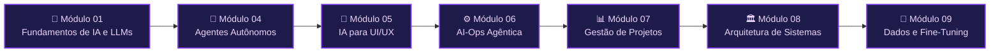

<!-- markdownlint-disable MD033 MD041 -->

  

<h1 align="center">📘 Manual Expandido — Engenharia de Software com IA Aplicada</h1>

  <em>Cada capítulo do curso, expandido em conteúdo didático, com diagramas, imagens e vídeos.</em>

  <a href="../README.md">⬅️ Voltar para o índice de referências</a>

---

## 🎯 Sobre este manual

O [`README.md`](../README.md) na raiz é o **índice de referências** do curso: uma coleção enxuta de links por módulo. Este manual (`conteudo/`) é a versão **expandida e didática** desse índice — cada capítulo ganhou:

- 📖 **Conteúdo escrito** explicando os conceitos, não só os links;
- 🗺️ **Diagramas** (Mermaid, renderizados nativamente pelo GitHub) para visualizar arquiteturas e fluxos;
- 🖼️ **Imagens** de abertura para cada capítulo;
- 🎬 **Vídeos** incorporados (miniaturas clicáveis) a partir das referências de cada aula;
- 🧪 **Projetos do repositório** com o comando exato para rodar cada exemplo;
- ✍️ **Atividades "mão na massa"** para praticar.

> [!NOTE]
> O conteúdo aqui é **fiel ao que existe no repositório**: cada projeto citado aponta para a pasta real e o comando real de execução, extraídos dos `package.json`, `UNIDADE.md`, `README.md` e scripts de cada módulo.

---

## 🧭 Mapa do curso

---

## 📚 Capítulos

| # | Capítulo | O que você aprende | Stack principal |
|---|----------|--------------------|-----------------|
| 01 | [**Fundamentos de IA e LLMs para Programadores**](./modulo-01.md) | Redes neurais no browser, Web AI, prompt engineering, MCPs, modelos locais vs. nuvem, RAG | TensorFlow.js, Chrome Web AI, Playwright, Ollama, OpenRouter, Neo4j |
| 04 | [**Criação de Agentes Autônomos**](./modulo-04.md) | ReAct, function calling, memória, contexto, LangGraph, observabilidade, multiagentes | TypeScript, LangChain/LangGraph, OpenRouter, SQLite, React |
| 05 | [**Ferramentas de IA para UI e UX**](./modulo-05.md) | Discovery, prototipação design→código, agentes CLI, MCP/E2E, integração de IA | Gemini/AI Studio, Angular, Nx, Genkit, Figma/Stitch |
| 06 | [**AI-Ops e Engenharia Agêntica (Nexus)**](./modulo-06.md) | 12 laboratórios de IA operando infra real sob governança | CrewAI, Groq, Kubernetes, Terraform, Streamlit, Prometheus |
| 07 | [**Ferramentas de IA para Gestão de Projetos**](./modulo-07.md) | Discovery→backlog, priorização, cronograma, previsões, riscos, OKRs (caso RouteWise) | Gemini, Jira, Monte Carlo, Danger.js, Make.com, Slack |
| 08 | [**Arquitetura de Sistemas com IA**](./modulo-08.md) | Padrões de arquitetura agêntica (caso TrialForge): single/multi-agent, RAG, enterprise | Ollama, JS + Python (paridade) |
| 09 | [**Processamento de Dados e Fine-Tuning**](./modulo-09.md) | Decisão, preparação de datasets, fine-tuning via API, LoRA/PEFT, avaliação (caso Amplitude Seguros) | Vertex AI, MLX-LM, JS + Python |

---

## 🚀 Como usar

1. Comece pelo [Módulo 01](./modulo-01.md) se você é novo em IA aplicada.
2. Cada capítulo é **autocontido**: leia o conteúdo, assista aos vídeos, rode os projetos e faça as atividades.
3. Ao final de cada capítulo há navegação para o **anterior / próximo**.
4. Para adaptar os exercícios ao **Windows**, use a skill [`windowsfy`](../skills/windowsfy/SKILL.md).

> [!TIP]
> Problemas de ambiente? Veja [Docker](../troubleshooting/docker.md) e [Windows](../troubleshooting/windows/commons.md).

---

  <a href="./modulo-01.md">Começar pelo Módulo 01 ➡️</a>

