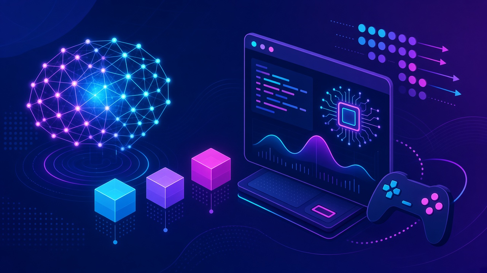
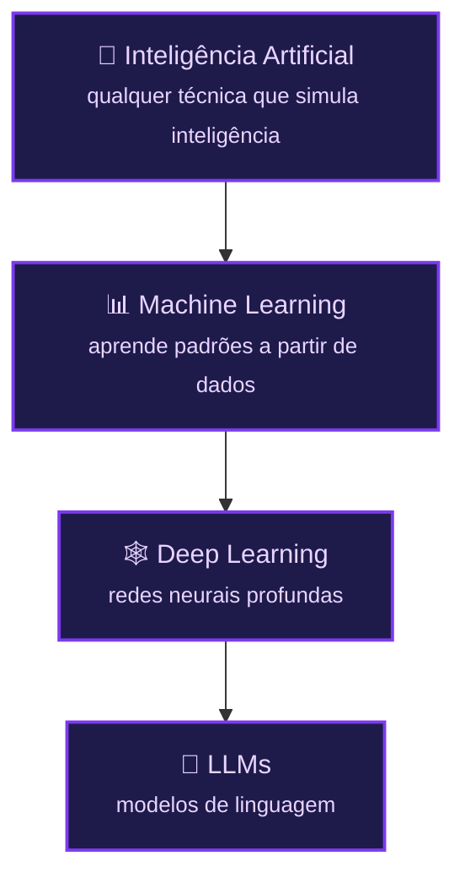
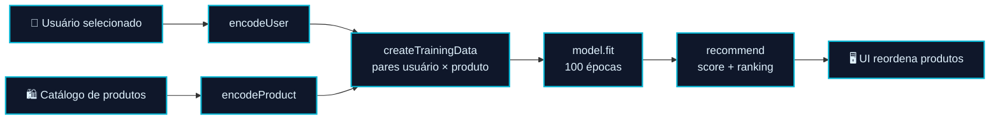
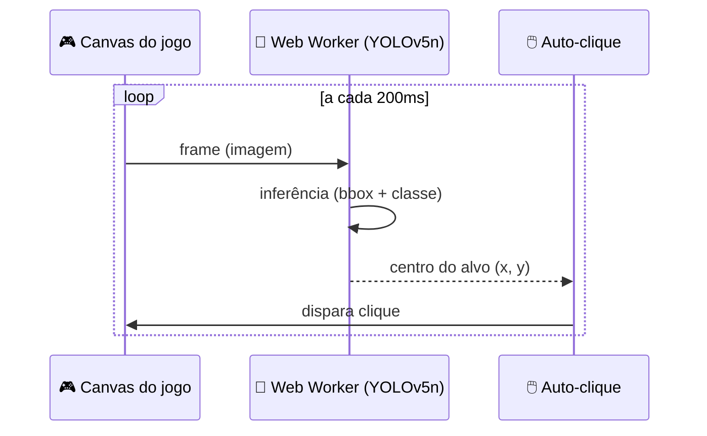
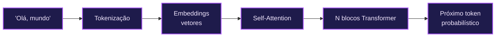
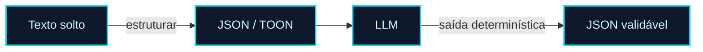
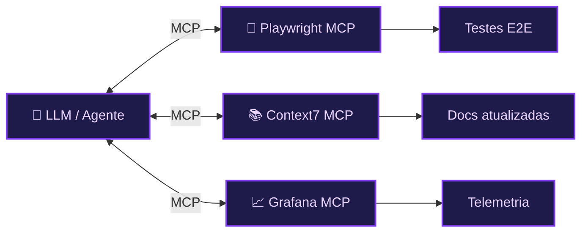
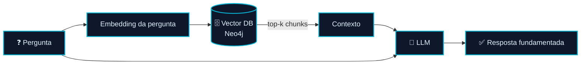

<!-- markdownlint-disable MD033 MD041 -->
<p align="center">
  
</p>

<p align="center">
  <a href="./README.md">🏠 Índice do manual</a> · <a href="./modulo-04.md">Próximo: Módulo 04 ➡️</a>
</p>

# 📗 Módulo 01 — Fundamentos de IA e LLMs para Programadores

> Do primeiro tensor à primeira aplicação de RAG: como a IA realmente funciona para quem escreve código — rodando **no navegador**, **localmente** e **na nuvem**.

## 🧭 Neste capítulo

- [1.1 — Introdução: o que é IA, ML e Deep Learning](#11--introdução-o-que-é-ia-ml-e-deep-learning)
- [1.3 — Deep Learning: sistemas de recomendação na prática](#13--deep-learning-sistemas-de-recomendação-na-prática)
- [1.4 — Web Machine Learning: vencendo qualquer jogo](#14--web-machine-learning-vencendo-qualquer-jogo)
- [5 — Inteligência artificial na Web](#5--inteligência-artificial-na-web)
- [6 — Prompt Engineering na prática](#6--prompt-engineering-na-prática)
- [7 — Ferramentas de IA para acelerar sua vida como Dev](#7--ferramentas-de-ia-para-acelerar-sua-vida-como-dev)
- [8 — MCPs e automação para devs](#8--mcps-e-automação-para-devs)
- [9 — Modelos open-source vs. proprietários](#9--modelos-open-source-vs-proprietários)
- [10 — RAG, embeddings e busca semântica](#10--rag-embeddings-e-busca-semântica)
- [🧪 Mão na massa](#-mão-na-massa)

## 🎯 Objetivos de aprendizagem

Ao final deste módulo você será capaz de:

- Explicar a diferença entre **IA, Machine Learning e Deep Learning** e treinar uma rede neural simples.
- Rodar modelos de ML **direto no navegador** com TensorFlow.js (recomendação e visão computacional).
- Usar as **Web AI APIs** do Chrome (Gemini Nano) para inferência local, incluindo multimodal.
- Escrever **prompts** melhores e estruturar dados com JSON/TOON.
- Conectar IA a ferramentas do mundo real via **MCP** (testes, navegação, documentação, telemetria).
- Rodar LLMs **localmente (Ollama)** e orquestrar modelos na **nuvem (OpenRouter)**.
- Construir seu primeiro **RAG** com embeddings e Neo4j.

---

## 1.1 — Introdução: o que é IA, ML e Deep Learning

Antes de LLMs, é preciso entender a pirâmide: **Inteligência Artificial** é o campo guarda-chuva; **Machine Learning** é o subconjunto que aprende padrões a partir de dados; **Deep Learning** usa redes neurais profundas para aprender representações complexas.



A melhor forma de sentir isso na prática é **treinar um modelo sem escrever código** com o [Teachable Machine](https://teachablemachine.withgoogle.com/) e, em seguida, treinar o mesmo tipo de classificador **com código** em JavaScript.

### 🧪 Projeto no repo — seu primeiro classificador com TensorFlow.js

| | |
|---|---|
| 📁 Pasta (esqueleto) | [`exemplo-00-template`](../modulo01-fundamentos-de-ia-e-llms-para-programadores/exemplo-00-template/) |
| 📁 Pasta (completo) | [`exemplo-00-z`](../modulo01-fundamentos-de-ia-e-llms-para-programadores/exemplo-00-z/) |
| ▶️ Rodar | `npm install && npm start` |
| 🔑 Requer | Nada (roda em Node com `@tensorflow/tfjs-node`) |

O exemplo `-z` monta uma rede densa (ReLU + softmax), treina com o otimizador **Adam** e `categoricalCrossentropy`, e classifica um novo perfil de cliente em **premium / medium / basic**, imprimindo as probabilidades no console. O `-template` traz o mesmo esqueleto **sem o treino**, para você implementar em aula.

> [!TIP]
> Ferramentas para "enxergar" redes neurais: [CNN Explainer](https://poloclub.github.io/cnn-explainer/), [GAN Lab](https://poloclub.github.io/ganlab/), [BertViz](https://github.com/jessevig/bertviz) e [Netron](https://netron.app/).

---

## 1.3 — Deep Learning: sistemas de recomendação na prática

Sistemas de recomendação são o "hello world" comercial do Deep Learning. Aqui você constrói um **e-commerce com motor de recomendação** que roda **inteiramente no navegador**, usando um **Web Worker** para não travar a UI durante o treino.



### 🧪 Projeto no repo — recomendação de e-commerce (evolução em 5 partes)

| | |
|---|---|
| 📁 Pasta | [`exemplo-01-ecommerce-recomendations-z`](../modulo01-fundamentos-de-ia-e-llms-para-programadores/exemplo-01-ecommerce-recomendations-z/) (subpastas `parte01`…`parte05`) |
| ▶️ Rodar | Em cada parte: `npm install && npm start` → `http://localhost:3000` |
| 🔑 Requer | Nada (TensorFlow.js via CDN, roda no browser) |

Cada parte é um **snapshot incremental** do `modelTrainingWorker.js`:

| Parte | Foco |
|-------|------|
| `parte01` | `makeContext` + início do `trainModel` (para em `debugger`) |
| `parte02` | `encodeProduct`, vetores de produto, pesos por feature |
| `parte03` | `encodeUser` + `createTrainingData` (pares usuário × produto) |
| `parte04` | Rede densa + **`model.fit`** (100 épocas, logs de loss/accuracy) |
| `parte05` | **`recommend`** com scores, ranking e evento `recommendationsReady` |

O esqueleto inicial está em [`exemplo-01-ecommerce-recomendations-template`](../modulo01-fundamentos-de-ia-e-llms-para-programadores/exemplo-01-ecommerce-recomendations-template/).

---

## 1.4 — Web Machine Learning: vencendo qualquer jogo

E se a IA pudesse **ver a tela e jogar sozinha**? Neste projeto, um modelo **YOLOv5n** roda via TensorFlow.js em um **Web Worker**, captura um frame do canvas a cada 200 ms, detecta o alvo e **dispara o clique automaticamente** no clássico Duck Hunt.



### 🧪 Projeto no repo — Duck Hunt com visão computacional

| | |
|---|---|
| 📁 Pasta | [`exemplo-02-vencendo-qualquer-jogo`](../modulo01-fundamentos-de-ia-e-llms-para-programadores/exemplo-02-vencendo-qualquer-jogo/) (`DuckHunt-JS-parte01`, `parte02`, `_template`) |
| ▶️ Rodar | `npm install && npm start` → `http://localhost:8080` |
| 🔑 Requer | Nada |

- **parte01** — o worker carrega o YOLO mas envia uma predição fixa (didático).
- **parte02** — filtra detecções por limiar, calcula o centro do *bounding box* e mira/atira.

---

## 5 — Inteligência artificial na Web

### 5.1 — Algoritmos genéticos e aprendizado por reforço

Nem toda IA aprende com *backpropagation*. **Algoritmos genéticos** evoluem soluções por seleção natural, e **Reinforcement Learning** aprende por tentativa e erro. Comece pelos clássicos interativos: [carros genéticos](https://rednuht.org/genetic_cars_2/) e [cart-pole no navegador](https://storage.googleapis.com/tfjs-examples/cart-pole/dist/index.html).

**🎬 Vídeos da aula**

[](https://youtu.be/P7XHzqZjXQs?t=1453)
[](https://youtu.be/r8KWciNmEGw?t=862)
[](https://www.youtube.com/watch?v=cdUNkwXx-I4)

### 5.2 — Como funcionam LLMs: transformers, embeddings, attention

O coração dos LLMs é a arquitetura **Transformer**: texto vira **tokens**, tokens viram **embeddings**, e o mecanismo de **attention** decide o que é relevante em cada passo.



Experimente o [tokenizer da OpenAI](https://platform.openai.com/tokenizer) para ver como seu texto é fatiado (e por que isso afeta custo).

**🎬 Vídeos da aula**

[](https://www.youtube.com/watch?v=ynNDmp7hBdo)
[](https://youtu.be/qFoFKLI3O8w)
[](https://www.youtube.com/watch?v=NKnZYvZA7w4)

### 5.3 — Web AI: IA nativa no navegador (Gemini Nano)

O Chrome traz a **Prompt API** com o **Gemini Nano** rodando **on-device** — sem servidor, sem chave de API, com privacidade. Você controla `temperature` e `topK` e recebe a resposta em **streaming**.

**🎬 Vídeo da aula**

[](https://youtu.be/IC256KyITLw?t=62)

### 🧪 Projetos no repo — Web AI

| Projeto | O que demonstra | Rodar |
|---------|-----------------|-------|
| [`exemplo-03-webai01`](../modulo01-fundamentos-de-ia-e-llms-para-programadores/exemplo-03-webai01/) | `promptStreaming` + system prompt, render Markdown | Servir o `index.html` no **Chrome** com a flag *Prompt API for Gemini Nano* |
| [`exemplo-04-webai02-temperature-and-topK`](../modulo01-fundamentos-de-ia-e-llms-para-programadores/exemplo-04-webai02-temperature-and-topK/) | UI ajustando `temperature`/`topK`, cancelamento | `npm start` (`npx http-server .`) |

> [!IMPORTANT]
> As Web AI APIs dependem de **flags experimentais do Chrome**. Se a resposta vier vazia, confira em `chrome://flags` se a *Prompt API for Gemini Nano* está habilitada e o modelo baixado.

### 5.4 — Web AI multimodal

A evolução: anexar **imagem/áudio** e usar as APIs **Translator** e **LanguageDetector** para um chat multimodal totalmente local, organizado em MVC.

**🎬 Vídeo da aula**

[](https://www.youtube.com/watch?v=ka2Zzw_qors)

### 🧪 Projeto no repo — multimodal

| | |
|---|---|
| 📁 Pasta | [`exemplo-05-webai03-multimodal`](../modulo01-fundamentos-de-ia-e-llms-para-programadores/exemplo-05-webai03-multimodal/) |
| ▶️ Rodar | `npm start` (`npx http-server .`) |
| 🔑 Requer | Chrome com flags Prompt API + Translation API + Language Detection API |

---

## 6 — Prompt Engineering na prática

### 6.1 — Escrevendo prompts que geram boas respostas

Prompt não é "conversa", é **especificação**. Um bom prompt define papel, contexto, formato de saída e restrições.

**🎬 Vídeo da aula**

[](https://youtu.be/ysPbXH0LpIE)

Referências essenciais: [guia da OpenAI](https://platform.openai.com/docs/guides/prompt-engineering), [context engineering da Anthropic](https://www.anthropic.com/engineering/effective-context-engineering-for-ai-agents) e [boas práticas do Claude 4](https://platform.claude.com/docs/en/build-with-claude/prompt-engineering/claude-4-best-practices).

### 6.2 — Padrão TOON e JSON para prompts

Modelos respondem melhor quando os **dados de entrada são estruturados**. O formato **[TOON](https://github.com/toon-format/toon)** promete a legibilidade do JSON com menos tokens. Teste no [playground TOON](https://toontools.vercel.app/playground).



---

## 7 — Ferramentas de IA para acelerar sua vida como Dev

### 7.1 — Cursor, VSCode, Windsurf: o cenário dos IDEs com IA

O mercado de IDEs com IA explodiu. Vale entender a [história do Cursor](https://www.latent.space/p/cursor), os [custom agents do VSCode/Copilot](https://code.visualstudio.com/docs/copilot/customization/custom-agents) e por que autonomia sem guardrails é perigosa (o [caso do banco de dados apagado no Replit](https://fortune.com/2025/07/23/ai-coding-tool-replit-wiped-database-called-it-a-catastrophic-failure/)).

### 7.2 — O que são agentes de IA e como decidem em etapas

Introdução ao conceito que o [Módulo 04](./modulo-04.md) aprofunda: agentes que **planejam, agem e observam** em loop. Leia sobre [Spec-Driven Development](https://developer.microsoft.com/blog/spec-driven-development-spec-kit) e [git worktrees](https://www.marcohaber.dev/blog/git-worktrees) para trabalhar com múltiplos agentes em paralelo.

---

## 8 — MCPs e automação para devs

O **Model Context Protocol (MCP)** é o "USB-C" da IA: um padrão aberto para conectar modelos a ferramentas e serviços. Foi criado pela [Anthropic](https://www.anthropic.com/news/model-context-protocol) e documentado em [modelcontextprotocol.io](https://modelcontextprotocol.io/).



### 🧪 Projetos no repo — MCP na prática

| Projeto | O que faz | Requer |
|---------|-----------|--------|
| [`exemplo-06-playwright-testes`](../modulo01-fundamentos-de-ia-e-llms-para-programadores/exemplo-06-playwright-testes/) | Gera testes E2E TypeScript a partir de prompts + Playwright MCP | `PLAYWRIGHT_MCP_EXTENSION_TOKEN` |
| [`exemplo-07-playwright-navegacao`](../modulo01-fundamentos-de-ia-e-llms-para-programadores/exemplo-07-playwright-navegacao/) | Automação de browser: lê Sessionize, preenche Google Forms (sem enviar) | `PLAYWRIGHT_MCP_EXTENSION_TOKEN` |
| [`exemplo-08-context7`](../modulo01-fundamentos-de-ia-e-llms-para-programadores/exemplo-08-context7/) | Consulta docs atualizadas (Context7) e gera demo Next.js + Better Auth | GitHub OAuth (`GITHUB_CLIENT_ID/SECRET`) |
| [`exemplo-09-grafana-mcp`](../modulo01-fundamentos-de-ia-e-llms-para-programadores/exemplo-09-grafana-mcp/) | Diagnóstico assistido por IA sobre a stack OpenTelemetry (app **Alumnus**) | Docker + MCP Grafana |

Para o `exemplo-08`, a demo gerada roda com:

```sh
cd exemplo-08-context7/nextjs-better-auth-demo
npm install
npx @better-auth/cli migrate
npm run dev   # http://localhost:3000
```

Para o `exemplo-09`, a stack de observabilidade sobe com Docker:

```sh
cd exemplo-09-grafana-mcp/alumnus
npm run docker:infra:up
npm start
```

---

## 9 — Modelos open-source vs. proprietários

### 9.1 — Aberto x fechado (e sem censura)

Trade-offs de custo, privacidade, controle e censura. Explore o catálogo de [open LLMs](https://github.com/eugeneyan/open-llms) e os [modelos abertos da OpenAI](https://openai.com/open-models/).

### 9.2 — Rodando modelos localmente com Ollama

Com o [Ollama](https://ollama.com/) você roda modelos na sua máquina via uma API compatível com a da OpenAI.

### 🧪 Projeto no repo — Ollama

| | |
|---|---|
| 📁 Pasta | [`exemplo-10-ollama`](../modulo01-fundamentos-de-ia-e-llms-para-programadores/exemplo-10-ollama/) |
| ▶️ Rodar | Ollama em `localhost:11434`; execute os trechos de `request.sh` (`ollama pull`, `curl` + `jq`) |
| 🔎 Demonstra | Compara um modelo *uncensored* com um que **recusa** e expõe o campo `thinking` |

### 9.3 — OpenRouter: orquestrando vários modelos

O [OpenRouter](https://openrouter.ai/) é um agregador: uma única chave para dezenas de modelos, inclusive [gratuitos](https://openrouter.ai/models?max_price=0).

### 🧪 Projeto no repo — OpenRouter

| | |
|---|---|
| 📁 Pasta | [`exemplo-11-openrouter`](../modulo01-fundamentos-de-ia-e-llms-para-programadores/exemplo-11-openrouter/) |
| ▶️ Rodar | Crie um `.env` com `OPENROUTER_API_KEY` e rode os `curl` de `request.sh` |
| 🔑 Requer | `OPENROUTER_API_KEY` (modelo free: `google/gemma-3-27b-it:free`) |

---

## 10 — RAG, embeddings e busca semântica

### 10.1 — O que é RAG e por que importa

**RAG (Retrieval-Augmented Generation)** conecta o LLM a uma base de conhecimento externa: em vez de "alucinar", o modelo **recupera** trechos relevantes e **gera** a resposta a partir deles. O paper seminal é [Lewis et al., 2020](https://arxiv.org/pdf/2005.11401).



### 10.2 e 10.3 — Embeddings, Vector DBs e seu primeiro RAG

### 🧪 Projetos no repo — embeddings e RAG com Neo4j

| Projeto | O que demonstra | Requer |
|---------|-----------------|--------|
| [`exemplo-12-embeddings-neo4j-template`](../modulo01-fundamentos-de-ia-e-llms-para-programadores/exemplo-12-embeddings-neo4j-template/) | Esqueleto do pipeline (implementar em aula) | Neo4j (Docker) |
| [`exemplo-12-embeddings-neo4j`](../modulo01-fundamentos-de-ia-e-llms-para-programadores/exemplo-12-embeddings-neo4j/) | Ingestão de PDF + **busca vetorial** (sem geração) | Neo4j, `EMBEDDING_MODEL` |
| [`exemplo-13-embeddings-neo4j-rag`](../modulo01-fundamentos-de-ia-e-llms-para-programadores/exemplo-13-embeddings-neo4j-rag/) | **RAG completo**: retrieval + resposta via OpenRouter | Neo4j + `OPENROUTER_API_KEY` |

```sh
# exemplo-12 e 13 (Node 22)
npm run infra:up   # sobe Neo4j via docker-compose
npm start          # indexa e consulta
```

> [!NOTE]
> O `exemplo-12` usa embeddings locais (`Xenova/all-MiniLM-L6-v2`) e só faz **busca**; o `exemplo-13` adiciona a classe `AI` que monta o contexto e **gera** a resposta, salvando os resultados em `respostas/*.md`.

---

## 🧪 Mão na massa

1. **Treine e classifique:** rode `exemplo-00-z` e mude os dados de treino — adicione uma 4ª categoria de cliente e observe as probabilidades.
2. **Recomende:** rode `parte05` do e-commerce e altere os pesos por feature em `encodeProduct`. As recomendações mudam como você esperava?
3. **Web AI:** abra `exemplo-04` no Chrome, suba a `temperature` para ~1.5 e depois para ~0.1. Descreva o efeito no texto gerado.
4. **RAG:** suba o `exemplo-13`, faça uma pergunta cuja resposta **não** está no PDF e observe como o modelo se comporta.

---

## 📚 Recursos e leituras

- [TensorFlow.js](https://www.tensorflow.org/js) · [Teachable Machine](https://teachablemachine.withgoogle.com/) · [Netron](https://netron.app/)
- [Chrome Built-in AI](https://developer.chrome.com/docs/ai/built-in) · [Web AI demos](https://chrome.dev/web-ai-demos/)
- [Guia de Prompt Engineering (OpenAI)](https://platform.openai.com/docs/guides/prompt-engineering) · [TOON](https://github.com/toon-format/toon)
- [Model Context Protocol](https://modelcontextprotocol.io/) · [Context7](https://context7.com/)
- [Ollama](https://ollama.com/) · [OpenRouter](https://openrouter.ai/) · [Neo4j](https://neo4j.com/)

---

<p align="center">
  <a href="./README.md">🏠 Índice</a> · <a href="./modulo-04.md">Próximo: Módulo 04 — Agentes Autônomos ➡️</a>
</p>
