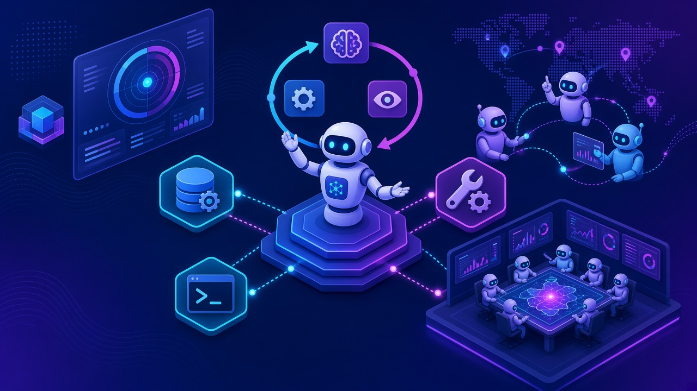
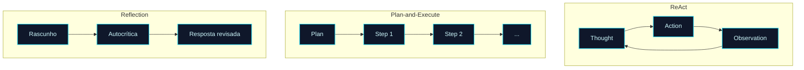
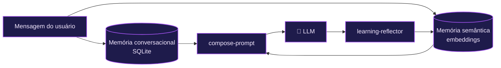
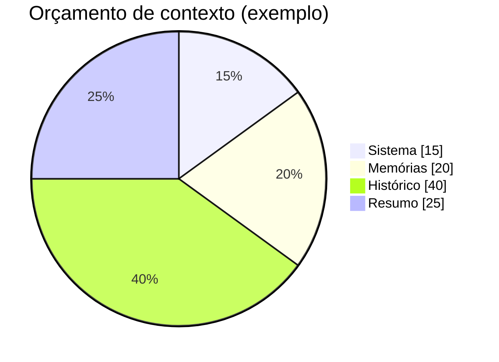
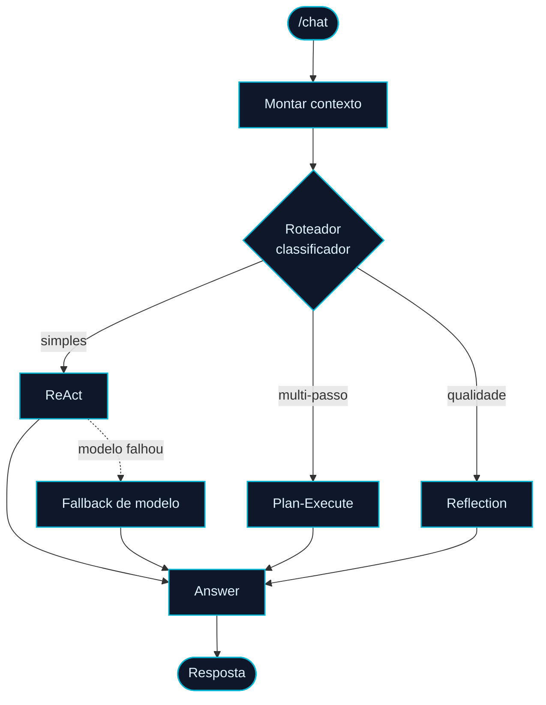
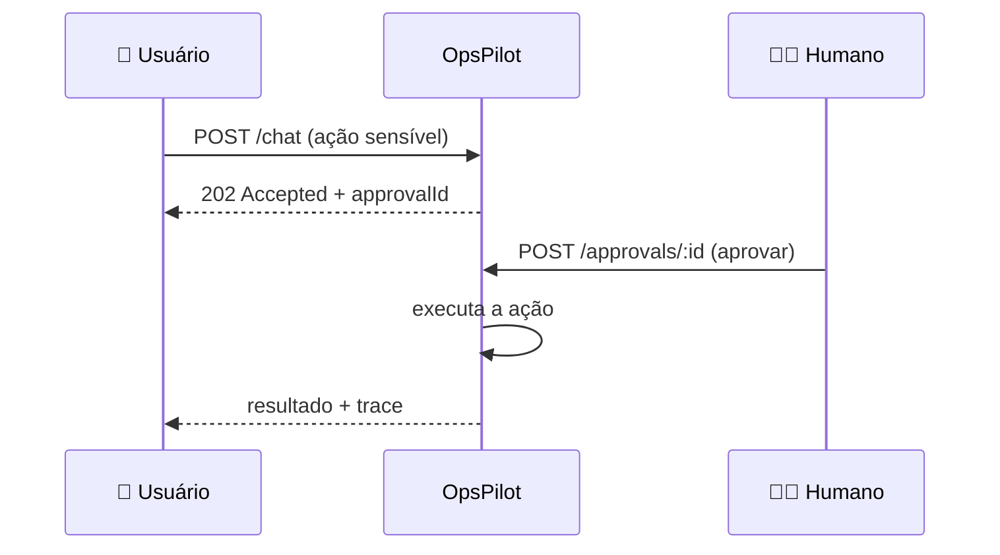
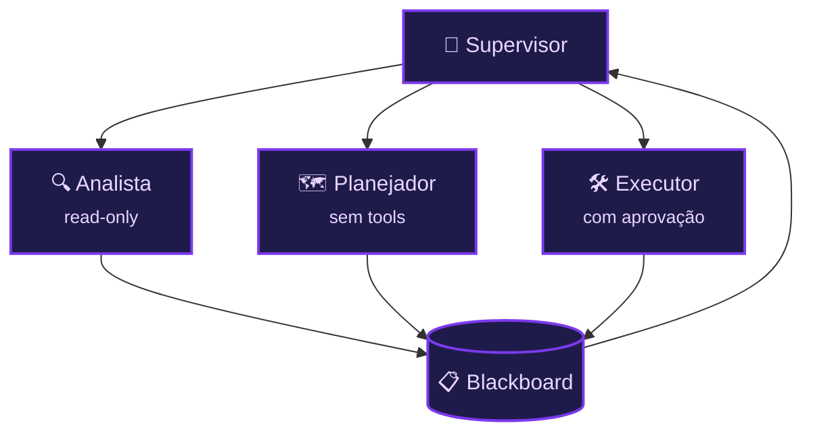

<!-- markdownlint-disable MD033 MD041 -->
<p align="center">
  
</p>

<p align="center">
  <a href="./modulo-01.md">⬅️ Anterior: Módulo 01</a> · <a href="./README.md">🏠 Índice</a> · <a href="./modulo-05.md">Próximo: Módulo 05 ➡️</a>
</p>

# 🤖 Módulo 04 — Criação de Agentes Autônomos

> Do primeiro loop **ReAct** a um copiloto de plantão **multiagente e publicado**: construindo o **OpsPilot** unidade a unidade, com LangChain/LangGraph sobre OpenRouter.

## 🧭 Neste capítulo

- [Visão geral: dois projetos, um método](#visão-geral-dois-projetos-um-método)
- [4.1 — Arquitetura de Agentes de Código](#41--arquitetura-de-agentes-de-código-notas-api)
- [4.2 — Padrões de Raciocínio e Execução](#42--padrões-de-raciocínio-e-execução)
- [4.3 — Function Calling e Tool Use](#43--function-calling-e-tool-use)
- [4.4 — Memória e Reflexão](#44--memória-e-reflexão)
- [4.5 — Gerenciamento de Contextos](#45--gerenciamento-de-contextos)
- [4.6 — LangGraph e Workflows Complexos](#46--langgraph-e-workflows-complexos)
- [4.7 — Observabilidade e Limites de Autonomia](#47--observabilidade-e-limites-de-autonomia)
- [4.8 — Projeto Prático: OpsPilot publicado](#48--projeto-prático-opspilot-publicado)
- [4.9 — Multi-Agent Systems](#49--multi-agent-systems)
- [🧪 Mão na massa](#-mão-na-massa)

## 🎯 Objetivos de aprendizagem

- Diferenciar **agentes de código** (GitHub Copilot com método) de **agentes LLM autônomos**.
- Implementar os padrões **ReAct**, **Plan-and-Execute** e **Reflection**.
- Dar **ferramentas** ao agente (function calling, SQLite, tool externa, servidor MCP).
- Adicionar **memória** (conversacional e semântica) e **reflexão como aprendizado**.
- Controlar o **orçamento de contexto** (tokens, sumarização, budgets por seção).
- Orquestrar tudo em um **grafo LangGraph** com roteador e *fallback* de modelo.
- Adicionar **observabilidade** e **limites de autonomia** (human-in-the-loop).
- Publicar uma **war room web** e evoluir para um **time multiagente**.

---

## Visão geral: dois projetos, um método

> Material da **regravação** do módulo (pasta `-novo`). Mapa completo em [`modulo04-criacao-de-agentes-autonomos-novo/`](../modulo04-criacao-de-agentes-autonomos-novo/).

O módulo constrói **dois** projetos do zero:

1. **Notas API** (Unidade 1) — operar o **GitHub Copilot** com método: `instructions`, spec-driven development e guardrails.
2. **OpsPilot** (Unidades 2–9) — um copiloto de plantão / *incident commander* para o e-commerce fictício "Mercadinho", que **evolui unidade a unidade** até virar produto publicado com modo multiagente.

Cada pasta é um **snapshot completo** ao final da unidade (as pastas do OpsPilot são **cumulativas**), com um `UNIDADE.md` explicando o que é novo.

```mermaid
flowchart LR
    U1["4.1 Notas API<br/>agente de código"] --> U2["4.2 ReAct /<br/>Plan-Execute /<br/>Reflection"]
    U2 --> U3["4.3 Tools +<br/>SQLite + MCP"]
    U3 --> U4["4.4 Memória +<br/>reflexão"]
    U4 --> U5["4.5 Contexto +<br/>sumarização"]
    U5 --> U6["4.6 LangGraph +<br/>roteador + fallback"]
    U6 --> U7["4.7 Observabilidade<br/>+ HIL"]
    U7 --> U8["4.8 War room web<br/>publicada"]
    U8 --> U9["4.9 Multiagente<br/>supervisor + blackboard"]
    classDef n fill:#1e1b4b,stroke:#7c3aed,color:#e9d5ff,stroke-width:2px;
    class U1,U2,U3,U4,U5,U6,U7,U8,U9 n;
```



> [!IMPORTANT]
> **Stack e execução (Unidades 2–9):** TypeScript ESM + LangChain/LangGraph + OpenRouter + SQLite. Padrão em cada pasta:
> ```sh
> npm ci
> cp .env.example .env   # preencha OPENROUTER_API_KEY
> npm run dev            # sobe a API
> npm test && npm run typecheck
> ```

---

## 4.1 — Arquitetura de Agentes de Código (Notas API)

Antes de construir um agente LLM, aprenda a **dirigir** um agente de código (GitHub Copilot) com engenharia de contexto: `.github/copilot-instructions.md`, prompts reutilizáveis, uma `constitution.md` e specs versionadas.

| | |
|---|---|
| 📁 Pasta | [`01-arquitetura-de-agentes-de-codigo/`](../modulo04-criacao-de-agentes-autonomos-novo/01-arquitetura-de-agentes-de-codigo/) |
| ▶️ Rodar | de `notas-api/`: `npm run dev`, `npm run cli`, `npm test`, `npm run typecheck` |
| 🔑 Requer | Node 22 + TypeScript + zod (sem LLM) |

Conceitos: **spec-driven development**, guardrails, delegação e a base de contexto que sustenta todo o resto do módulo.

---

## 4.2 — Padrões de Raciocínio e Execução

Aqui nasce o OpsPilot. Você implementa três estratégias de raciocínio e um **trace tipado** (thought / action / observation / plan / critique / answer).



| | |
|---|---|
| 📁 Pasta | [`02-padroes-de-raciocinio-e-execucao/`](../modulo04-criacao-de-agentes-autonomos-novo/02-padroes-de-raciocinio-e-execucao/) |
| 🗂️ Código | `src/strategies/react.ts`, `plan-execute.ts`, `reflect.ts`; trace em `src/trace/builder.ts` |
| ▶️ Rodar | `npm run dev` · **arena** (`npm run arena`) · **bench** (`npm run bench`) |
| 🔑 Requer | `OPENROUTER_API_KEY` |

O **arena** e o **bench** comparam a acurácia das estratégias contra o estado simulado da loja (ferramentas mock: `list_alerts`, `open_incident`, `resolve_incident`).

---

## 4.3 — Function Calling e Tool Use

O agente ganha **mãos**: expõe `POST /chat`, persiste incidentes em **SQLite**, chama uma **tool externa** (status de provedores via statuspage.io) e publica um **servidor MCP**.

| | |
|---|---|
| 📁 Pasta | [`03-function-calling-e-tool-use/`](../modulo04-criacao-de-agentes-autonomos-novo/03-function-calling-e-tool-use/) |
| 🗂️ Código | `src/http/server.ts`, `src/tools/`, `sqlite-ops-store.ts`, `src/mcp/server.ts` |
| ▶️ Rodar | `npm run dev` · `npm run mcp` (servidor MCP) |
| 🔑 Requer | `OPENROUTER_API_KEY` · `OPSPILOT_DB` (padrão `./data/opspilot.db`) |

```sh
curl -s localhost:3000/chat -H 'content-type: application/json' \
  -d '{"message":"algum incidente aberto?","strategy":"react"}'
```

---

## 4.4 — Memória e Reflexão

Dois tipos de memória: **conversacional** (persistida em SQLite, com `conversationId`) e **semântica** (embeddings locais `all-MiniLM-L6-v2`, endpoint `POST /memories`, `userId` no chat). Um **reflexor de aprendizado** roda após a resposta e registra um evento `learning` no trace.



| | |
|---|---|
| 📁 Pasta | [`04-memoria-e-reflexao-em-agentes-autonomos/`](../modulo04-criacao-de-agentes-autonomos-novo/04-memoria-e-reflexao-em-agentes-autonomos/) |
| 🗂️ Código | `src/memory/` (`embeddings.ts`, `memory-store.ts`), `src/chat/` |
| ▶️ Rodar | `npm run dev` · `./scripts/conversa-longa.sh` |
| ⚠️ Nota | O primeiro run baixa o modelo de embedding localmente |

---

## 4.5 — Gerenciamento de Contextos

Contexto é um recurso **finito e caro**. Aqui você mede tokens, **sumariza** o histórico em janela deslizante e monta o prompt com **orçamentos por seção** (sistema, memórias, histórico, resumo).

| | |
|---|---|
| 📁 Pasta | [`05-gerenciamento-de-contextos/`](../modulo04-criacao-de-agentes-autonomos-novo/05-gerenciamento-de-contextos/) |
| 🗂️ Código | `src/context/tokens.ts`, `history-summarizer.ts`, `context-builder.ts` |
| ▶️ Rodar | `npm run dev` · `./scripts/conversa-longa.sh` (30 turnos) |
| ⚙️ Ajustes | `CONTEXT_BUDGET_SUMMARY`, `CONTEXT_BUDGET_HISTORY`, `CONTEXT_BUDGET_MEMORIES`, `CONTEXT_BUDGET_SYSTEM` |



---

## 4.6 — LangGraph e Workflows Complexos

Todas as estratégias convergem para um único **`StateGraph`** de produção: `context → roteador classificador → (react | plan-execute | reflect) → answer`. O `strategy` no `/chat` vira um **override opcional**. Entra também a **resiliência de modelo** (`withRetry`, `withFallbacks`, `OPENROUTER_MODEL_FALLBACK`).



| | |
|---|---|
| 📁 Pasta | [`06-langgraph-e-workflows-complexos/`](../modulo04-criacao-de-agentes-autonomos-novo/06-langgraph-e-workflows-complexos/) |
| 🗂️ Código | `src/graph/production-graph.ts`, `router.ts`, `src/agents/model.ts` |
| 🔑 Requer | `OPENROUTER_API_KEY`, `OPENROUTER_MODEL`, `OPENROUTER_MODEL_FALLBACK` |

---

## 4.7 — Observabilidade e Limites de Autonomia

Autonomia sem controle é risco. Aqui os **traces são persistidos** (`GET /requests/:id`), há um **logger JSON estruturado**, um **`GET /stats`** agregado e **human-in-the-loop**: requisições sensíveis retornam **202 + `approvalId`** e só executam após `POST /approvals/:id`.



| | |
|---|---|
| 📁 Pasta | [`07-observabilidade-e-limites-de-autonomia/`](../modulo04-criacao-de-agentes-autonomos-novo/07-observabilidade-e-limites-de-autonomia/) |
| 🗂️ Código | `src/obs/logger.ts`, `sqlite-request-store.ts`, `memory-approval-store.ts` |

---

## 4.8 — Projeto Prático: OpsPilot publicado

O backend completo ganha uma **war room em React** (chat, `TraceDrawer`, `ApprovalCard`), **CORS** configurável e deploy no **GitHub Pages** via Actions.

| | |
|---|---|
| 📁 Pasta | [`08-projeto-pratico-opspilot-publicado/`](../modulo04-criacao-de-agentes-autonomos-novo/08-projeto-pratico-opspilot-publicado/) |
| ▶️ Backend | `npm run dev` |
| ▶️ Web | `npm run web:dev` (Vite, porta 5173) · `npm run web:build` |
| ⚙️ Env | vars do OpenRouter + `OPSPILOT_CORS_ORIGINS` |

---

## 4.9 — Multi-Agent Systems

O passo final: um **time** coordenado por um **supervisor** com um **blackboard** compartilhado e papéis especializados:

- **analista** (somente leitura),
- **planejador** (sem ferramentas),
- **executor** (respeita a aprovação humana da Unidade 7).

O roteador ganha a rota **`team`** e o trace registra eventos **`handoff`** entre agentes.



| | |
|---|---|
| 📁 Pasta | [`09-multi-agent-systems/`](../modulo04-criacao-de-agentes-autonomos-novo/09-multi-agent-systems/) |
| 🗂️ Código | `src/team/` (`team-graph.ts`, `team-strategy.ts`) |
| ▶️ Disparar | `POST /chat` sem `strategy` fixa em uma solicitação complexa → rota `team` |

---

## 🧪 Mão na massa

1. **Compare estratégias:** rode o `arena` da Unidade 2 e registre qual estratégia acerta mais no estado da loja.
2. **Dê uma tool nova:** na Unidade 3, adicione uma ferramenta mock (ex.: `escalar_incidente`) e faça o agente usá-la.
3. **Estresse o contexto:** rode `scripts/conversa-longa.sh` (Unidade 5) e observe os eventos `summarize` no trace.
4. **HIL:** na Unidade 7, dispare uma ação sensível e aprove-a via `POST /approvals/:id`. Confira o trace persistido.
5. **Time:** na Unidade 9, envie um pedido multifacetado e siga os eventos `handoff` entre analista, planejador e executor.

---

## 📚 Recursos e leituras

- [LangChain](https://www.langchain.com/) · [LangGraph](https://langchain-ai.github.io/langgraphjs/)
- [OpenRouter](https://openrouter.ai/) · [modelos gratuitos](https://openrouter.ai/models?max_price=0)
- [Model Context Protocol](https://modelcontextprotocol.io/)
- [ReAct: Synergizing Reasoning and Acting (Yao et al.)](https://arxiv.org/abs/2210.03629)

---

<p align="center">
  <a href="./modulo-01.md">⬅️ Módulo 01</a> · <a href="./README.md">🏠 Índice</a> · <a href="./modulo-05.md">Próximo: Módulo 05 — IA para UI/UX ➡️</a>
</p>
