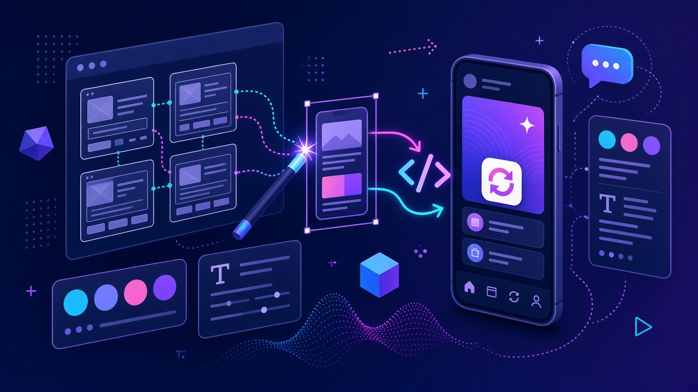
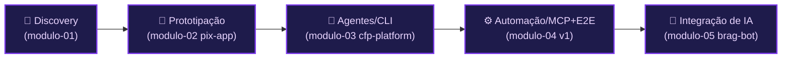
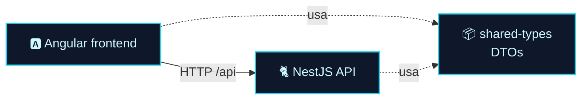
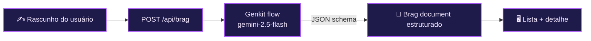

<!-- markdownlint-disable MD033 MD041 -->

  

  <a href="./modulo-04.md">⬅️ Anterior: Módulo 04</a> · <a href="./README.md">🏠 Índice</a> · <a href="./modulo-06.md">Próximo: Módulo 06 ➡️</a>

# 🎨 Módulo 05 — Ferramentas de IA para UI e UX

> A IA como uma **camada de engenharia** sobre o ciclo de produto: do *discovery* ao protótipo, de agentes de CLI a E2E com MCP, até integrar IA no cliente e no servidor.

👨‍🏫 Professor: Álvaro Camillo Neto · Pasta: [`modulo05-ferramentas-de-IA-para-UI-UX/`](../modulo05-ferramentas-de-IA-para-UI-UX/)

## 🧭 Neste capítulo

- [Panorama e stack](#panorama-e-stack)
- [5.1 — Estratégia e design de produto AI-first](#51--estratégia-e-design-de-produto-ai-first)
- [5.2 — Prototipação: do Figma ao código (pix-app)](#52--prototipação-do-figma-ao-código-pix-app)
- [5.3 — Agentes e CLI em um monorepo (cfp-platform)](#53--agentes-e-cli-em-um-monorepo-cfp-platform)
- [5.4 — Automação e MCP + E2E (cfp-platform v1)](#54--automação-e-mcp--e2e-cfp-platform-v1)
- [5.5 — Integração de IA no app (brag-bot com Genkit)](#55--integração-de-ia-no-app-brag-bot-com-genkit)
- [🧪 Mão na massa](#-mão-na-massa)

## 🎯 Objetivos de aprendizagem

- Usar a IA no **discovery**: refinar requisitos, gerar fluxos Mermaid e destilar feedback.
- Transformar **design em código** (Stitch/Figma → Angular) com prompts de acessibilidade e *design tokens*.
- Dirigir **agentes de CLI** em um monorepo real (Nx + NestJS + Angular).
- Automatizar **testes E2E semânticos** (Cypress com `cy.prompt`) e workflows OpenSpec via MCP.
- **Integrar IA** no produto com Firebase **Genkit** e saídas estruturadas por schema.

---

## Panorama e stack

**Stack:** Google **Gemini** via AI Studio, ecossistema **Firebase** (Hosting, AI Logic, Genkit), **Mermaid**, prompts JSON/estruturados, **Angular** e **Nx**.

> [!NOTE]
> Grande parte deste módulo é **prompt-driven**: os artefatos são bibliotecas de prompts + briefings que você roda no **Google AI Studio**. Onde há app executável, o comando real está indicado.

---

## 5.1 — Estratégia e design de produto AI-first

Refinamento de requisitos com IA: *rubber-ducking* com o Gemini, mapeamento de *unhappy paths*, estados de UI e uso de **temperatura baixa + JSON** para saídas determinísticas. O objetivo é transformar requisitos ambíguos (estilo app de Pix) e feedback bruto em **specs rastreáveis**, diagramas e um backlog priorizado.

| | |
|---|---|
| 📁 Pasta | [`modulo-01/`](../modulo05-ferramentas-de-IA-para-UI-UX/modulo-01/) |
| 🗂️ Prompts | `prompts/system-instructions-refinement.md`, `insights-distiller.md`, `data-sanitizer.md`, `ux-writing-system.md` |
| 📥 Entradas | `docs/refinement/briefing-bruto.md`, `data/raw-feedbacks.json` |
| ▶️ Rodar | Cole os prompts no **Google AI Studio** e rode contra o briefing/dados; exporte JSON/Mermaid para `report/` |
| 🔑 Requer | Google AI Studio / Gemini (navegador) |

---

## 5.2 — Prototipação: do Figma ao código (pix-app)

Handoff de design → front-end **Angular 21** com auxílio de IA: *scaffolding*, prompts de acessibilidade e *design tokens*. O app implementa fluxos de **Pix** (transferência, extrato, comprovante).

| | |
|---|---|
| 📁 Pasta | [`modulo-02/pix-app/`](../modulo05-ferramentas-de-IA-para-UI-UX/modulo-02/pix-app/) |
| ▶️ Rodar | `cd modulo-02/pix-app && npm install && npm start` → `http://localhost:4200/` |
| 🧪 Build/testes | `npm run build` · `npm test` |
| 🔌 MCP opcional | `.vscode/mcp.json` conecta a Angular CLI para desenvolvimento dirigido por agente |
| 🔑 Requer | Nada para rodar o app |

Rotas principais: `/pix` e `/extrato` (ver `src/app/app.routes.ts`). Os prompts de design ficam em `prompts/`, `briefing/` e o comprovante gerado pelo Stitch em `stitch/comprovante_stitch.html`.

---

## 5.3 — Agentes e CLI em um monorepo (cfp-platform)

Um **monorepo Nx** real de uma plataforma de **Call for Papers**: API **NestJS** + front **Angular** + **DTOs compartilhados**. O foco é usar agentes de CLI (Gemini CLI / padrões Nx) para *scaffolding* e refatoração num workspace multi-app.

| | |
|---|---|
| 📁 Pasta | [`modulo-03/cfp-platform/`](../modulo05-ferramentas-de-IA-para-UI-UX/modulo-03/cfp-platform/) |
| ▶️ Front | `npm install && npx nx serve frontend` (sobe `api:serve` junto) |
| ▶️ API | `npx nx serve api` (prefixo `api`, porta 3000) |
| 🗺️ Grafo | `npx nx graph` |
| 🔑 Requer | `PORT` opcional na API |

---

## 5.4 — Automação e MCP + E2E (cfp-platform v1)

A mesma stack CFP evolui: **workflows OpenSpec** para mudanças dirigidas por especificação e **Cypress** com testes E2E clássicos **e semânticos** (`cy.prompt`, guiado por IA).

| | |
|---|---|
| 📁 Pasta | [`modulo-04/cfp-plataform_v1/cfp-platform_v1/`](../modulo05-ferramentas-de-IA-para-UI-UX/modulo-04/cfp-plataform_v1/cfp-platform_v1/) |
| 🗂️ OpenSpec | `.agent/workflows/opsx-apply.md` (e correlatos) |
| 🧪 E2E IA | `frontend-e2e/cypress/e2e/event-registration-ai.cy.ts` |
| 🧪 E2E clássico | `event-registration.cy.ts` |
| ▶️ Rodar | mesmo padrão Nx do 5.3 (`npm install`, `npx nx serve frontend`) |

---

## 5.5 — Integração de IA no app (brag-bot com Genkit)

O fechamento: **Angular SSR + Express + Genkit** que transforma anotações informais de trabalho em um **"brag document"** estruturado — útil para PDIs e narrativa de carreira. Usa `gemini-2.5-flash` e saída por **JSON schema**.

| | |
|---|---|
| 📁 Pasta | [`modulo-05/brag-bot/`](../modulo05-ferramentas-de-IA-para-UI-UX/modulo-05/brag-bot/) |
| 🗂️ Código | `src/flows.ts` (fluxo Genkit), `src/server.ts` (`POST /api/brag`) |
| ▶️ Dev | `npm install && npm start` |
| ▶️ Genkit UI | `npm run genkit:ui` |
| ▶️ SSR prod | `npm run build && npm run serve:ssr:brag-bot` (porta 4000) |
| 🔑 Requer | **Google Generative AI API** (`GOOGLE_GENAI_API_KEY` ou equivalente do Genkit) |

---

## 🧪 Mão na massa

1. **Discovery:** rode o `insights-distiller.md` sobre `data/raw-feedbacks.json` no AI Studio e gere um backlog priorizado em JSON.
2. **Design→código:** suba o `pix-app` e peça a um agente para criar a tela de comprovante a partir de `stitch/comprovante_stitch.html`.
3. **Monorepo:** rode `npx nx graph` no `cfp-platform` e identifique as dependências entre `frontend`, `api` e `shared-types`.
4. **E2E IA:** execute o teste `event-registration-ai.cy.ts` e compare com a versão clássica.
5. **Genkit:** abra a Genkit UI (`npm run genkit:ui`) e inspecione o fluxo do `brag-bot`.

---

## 📚 Recursos e leituras

- [Google AI Studio](https://aistudio.google.com/) · [Google Stitch](https://stitch.withgoogle.com) · [Google Jules](https://jules.google/)
- [Firebase Genkit](https://genkit.dev/) · [Nx](https://nx.dev) · [OpenSpec](https://openspec.dev/)
- [Figma Dev Mode](https://www.figma.com/) · [Mermaid Live Editor](https://mermaid.live)

---

  <a href="./modulo-04.md">⬅️ Módulo 04</a> · <a href="./README.md">🏠 Índice</a> · <a href="./modulo-06.md">Próximo: Módulo 06 — AI-Ops ➡️</a>

