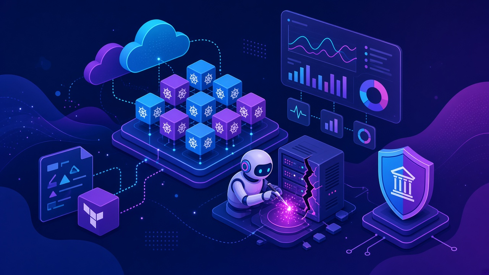
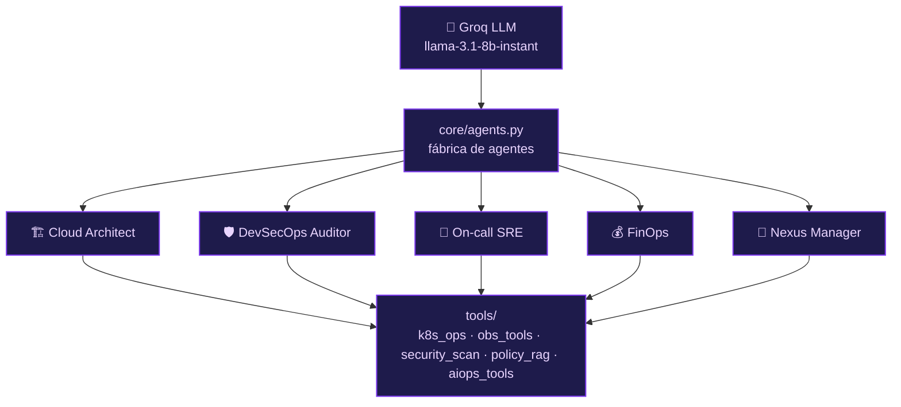
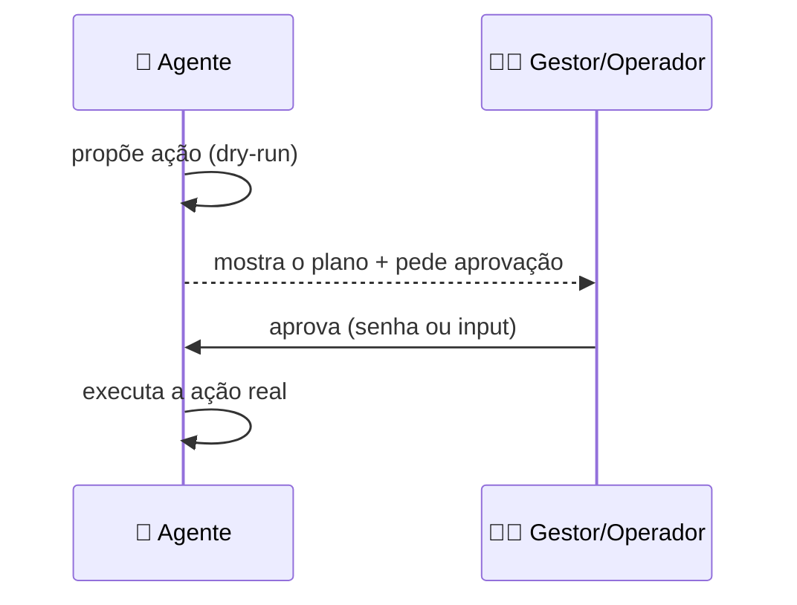

<!-- markdownlint-disable MD033 MD041 -->
<p align="center">
  
</p>

<p align="center">
  <a href="./modulo-05.md">⬅️ Anterior: Módulo 05</a> · <a href="./README.md">🏠 Índice</a> · <a href="./modulo-07.md">Próximo: Módulo 07 ➡️</a>
</p>

# ⚙️ Módulo 06 — AI-Ops e Engenharia Agêntica (Nexus)

> 12 laboratórios que evoluem da **IA consultiva** até um **ecossistema de agentes autônomos** que operam infraestrutura real (Kubernetes, Terraform, nuvem) **sob governança**.

<sub>Projeto completo: [`modulo06-aiops-engenharia-agentica/`](../modulo06-aiops-engenharia-agentica/) · trilha **Nexus AI-Ops**</sub>

## 🧭 Neste capítulo

- [Arquitetura compartilhada](#arquitetura-compartilhada)
- [Os 12 laboratórios](#os-12-laboratórios)
- [Como rodar](#como-rodar)
- [🧪 Mão na massa](#-mão-na-massa)

## 🎯 Objetivos de aprendizagem

- Aplicar IA a **DevOps/SRE**: IaC, Kubernetes, troubleshooting, AIOps preditivo, ChatOps.
- Orquestrar **agentes CrewAI** com papéis (arquiteto, auditor, SRE, FinOps, DevSecOps).
- Impor **governança**: human-in-the-loop, dry-run, políticas OPA, scans de segurança.
- Fechar com uma **orquestração hierárquica** multidomínio (Nexus Manager).

---

## Arquitetura compartilhada

Todos os labs compartilham a mesma base: um **LLM Groq** (`llama-3.1-8b-instant`), uma **fábrica de agentes** por papel e um conjunto de **ferramentas** (k8s, observabilidade, segurança, RAG de políticas).



| Recurso | Caminho |
|---------|---------|
| Config do LLM | `core/llm_config.py` (`GROQ_API_KEY`, `temperature=0.2`) |
| Agentes | `core/agents.py` |
| Ferramentas | `tools/` (`file_writer`, `k8s_ops`, `k8s_diag`, `obs_tools`, `aiops_tools`, `chatops_tools`, `security_scan`, `policy_rag`) |
| Menu CLI | `nexus_iac_copilot.py` (mapeia teclas 1–12) |
| Dashboard | `ui/app.py` (Streamlit: S3 via LocalStack, sandbox OPA) |
| Dependências | `requirements.txt` (`crewai`, `langchain-groq`, `streamlit`, `checkov`, `kubernetes`, `pandas`, `numpy`, `litellm`) |

---

## Os 12 laboratórios


| # | Lab | O que demonstra | Como rodar |
|---|-----|-----------------|-----------|
| 1 | [`modulo1_foundation.py`](../modulo06-aiops-engenharia-agentica/labs/modulo1_foundation.py) | IA consultiva: design de S3 sob política corporativa (`check_compliance_rules`) | `python3 labs/modulo1_foundation.py` |
| 2 | [`modulo2_iac_copilot.py`](../modulo06-aiops-engenharia-agentica/labs/modulo2_iac_copilot.py) | Gera + audita Terraform (Checkov + OPA) | `python3 labs/modulo2_iac_copilot.py` |
| 3 | [`modulo3_k8s_ops.py`](../modulo06-aiops-engenharia-agentica/labs/modulo3_k8s_ops.py) | Manifests K8s, sync GitOps e decisão de **canary** | `python3 labs/modulo3_k8s_ops.py` |
| 4 | [`modulo4_troubleshooting.py`](../modulo06-aiops-engenharia-agentica/labs/modulo4_troubleshooting.py) | **ReAct** de incidente (CrashLoop/OOMKilled) com Prometheus + Jaeger | `python3 labs/modulo4_troubleshooting.py` |
| 5 | [`modulo5_aiops.py`](../modulo06-aiops-engenharia-agentica/labs/modulo5_aiops.py) | NL → **PromQL**, alerta preditivo de disco, JSON de dashboard | `python3 labs/modulo5_aiops.py` |
| 6 | [`modulo6_chatops.py`](../modulo06-aiops-engenharia-agentica/labs/modulo6_chatops.py) | ChatOps (Slack sim) com HIL: `manager_password='GESTOR-APROVA'` | `streamlit run labs/modulo6_chatops.py` |
| 7 | [`modulo7_devsecops.py`](../modulo06-aiops-engenharia-agentica/labs/modulo7_devsecops.py) | Triagem de scan **Trivy** (prioriza CVE-2024-3094, XZ backdoor) | `python3 labs/modulo7_devsecops.py` |
| 8 | [`modulo8_cicd.py`](../modulo06-aiops-engenharia-agentica/labs/modulo8_cicd.py) | Otimiza workflow do GitHub Actions com cache | `python3 labs/modulo8_cicd.py` |
| 9 | [`modulo9_finops.py`](../modulo06-aiops-engenharia-agentica/labs/modulo9_finops.py) | Caça recursos "zumbis", *rightsizing* e ROI em USD | `python3 labs/modulo9_finops.py` |
| 10 | [`modulo10_remediation.py`](../modulo06-aiops-engenharia-agentica/labs/modulo10_remediation.py) | **RAG de runbooks** + rascunho de post-mortem | `python3 labs/modulo10_remediation.py` |
| 11 | [`modulo11_guardrails.py`](../modulo06-aiops-engenharia-agentica/labs/modulo11_guardrails.py) | Guardrails + HIL: dry-run + `input()` aprovar/negar antes do "apply" | `python3 labs/modulo11_guardrails.py` |
| 12 | [`modulo12_projeto_final.py`](../modulo06-aiops-engenharia-agentica/labs/modulo12_projeto_final.py) | **`Process.hierarchical`**: Nexus Manager delega a SRE + DevSecOps + FinOps | `python3 labs/modulo12_projeto_final.py` |

> [!TIP]
> O lab 12 coordena um incidente **multidomínio** (checkout com erro 500 + backdoor XZ + pico de custo de 40%) e consolida um **relatório executivo** — o clímax da trilha.

### O padrão de governança (labs 6 e 11)



---

## Como rodar

> [!IMPORTANT]
> **Pré-requisitos:** Python 3.10–3.13, Docker, `kubectl` e uma **chave Groq**.

```sh
cd modulo06-aiops-engenharia-agentica
python3 -m venv .venv && source .venv/bin/activate
pip install -r requirements.txt
export GROQ_API_KEY=...            # obrigatório

# opção A: menu interativo (labs 1–12 + dashboard)
python3 nexus_iac_copilot.py

# opção B: rodar um lab específico
python3 labs/modulo1_foundation.py

# opção C: dashboard premium
streamlit run ui/app.py
```

- O **lab 6** roda com `streamlit run` (não `python3`).
- Manifests em `k8s/` incluem um cenário de deploy quebrado, LocalStack e um serviço **Ollama** in-cluster (material de curso; o LLM de runtime dos labs é o **Groq**).
- Fixtures em `data/` (`trivy.json`, `inventario_cloud.json`, `runbook_db.md`, workflows).

---

## 🧪 Mão na massa

1. **Consultivo → executor:** rode o lab 1 e depois o lab 3; compare "recomendar" com "aplicar".
2. **Segurança:** no lab 7, edite `data/trivy.json` adicionando uma CVE crítica e veja a repriorização.
3. **FinOps:** no lab 9, altere `data/inventario_cloud.json` e recalcule o ROI.
4. **Governança:** rode o lab 11 e **negue** a aplicação no `input()`. O agente respeita o veto?
5. **Orquestração:** rode o lab 12 e leia o relatório consolidado do Nexus Manager.

---

## 📚 Recursos e leituras

- [CrewAI](https://www.crewai.com/) · [Groq](https://groq.com/) · [Streamlit](https://streamlit.io/)
- [Prometheus](https://prometheus.io/) · [Jaeger](https://www.jaegertracing.io/) · [Grafana](https://grafana.com/)
- [Trivy](https://trivy.dev/) · [Open Policy Agent](https://www.openpolicyagent.org/) · [Checkov](https://www.checkov.io/)
- [Kubernetes](https://kubernetes.io/) · [Terraform](https://www.terraform.io/) · [LocalStack](https://www.localstack.cloud/)

---

<p align="center">
  <a href="./modulo-05.md">⬅️ Módulo 05</a> · <a href="./README.md">🏠 Índice</a> · <a href="./modulo-07.md">Próximo: Módulo 07 — Gestão de Projetos ➡️</a>
</p>
