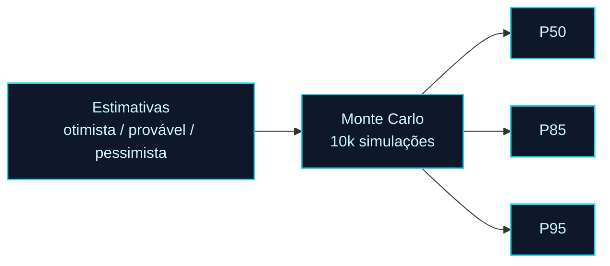

<!-- markdownlint-disable MD033 MD041 -->
<p align="center">
  
</p>

<p align="center">
  <a href="./modulo-06.md">⬅️ Anterior: Módulo 06</a> · <a href="./README.md">🏠 Índice</a> · <a href="./modulo-08.md">Próximo: Módulo 08 ➡️</a>
</p>

# 📊 Módulo 07 — Ferramentas de IA para Gestão de Projetos

> Um pipeline de gestão assistida por IA construído sobre um **caso único** — o **RouteWise** (gestão de frota com 140 veículos) — da transcrição de uma reunião de *discovery* até um portfólio com **OKRs** validados.

<sub>👨‍🏫 Professor: Dr. José Ahirton Batista Lopes Filho · Pasta: [`modulo07-ferramentas-de-ia-para-gestao-de-projetos/`](../modulo07-ferramentas-de-ia-para-gestao-de-projetos/)</sub>

## 🧭 Neste capítulo

- [O caso RouteWise](#o-caso-routewise)
- [As 10 ferramentas da disciplina](#as-10-ferramentas-da-disciplina)
- [Destaques executáveis](#destaques-executáveis)
- [🧪 Mão na massa](#-mão-na-massa)

## 🎯 Objetivos de aprendizagem

- Transformar **discovery bruto** em backlog estruturado (User Stories INVEST, Gherkin, Jira).
- Priorizar de forma defensável com **RICE** e **WSJF**.
- Montar cronogramas com dependências e **previsões probabilísticas** (PERT + Monte Carlo).
- Monitorar **riscos** por métricas de fluxo e turbinar **reuniões** e **status reports**.
- Impor **governança como código** (Danger.js) e automatizar o ecossistema (Slack → Jira).
- Validar **OKRs** e alinhar o portfólio à estratégia.

---

## O caso RouteWise

Cada módulo entrega um **prompt reutilizável**, dados de exemplo do RouteWise e uma atividade prática. A engine de todas as demos é o **Gemini** (AI Studio), com *system prompts* e temperatura calibrada por tarefa.


---

## As 10 ferramentas da disciplina

| # | Ferramenta | O que faz | Artefatos-chave |
|---|-----------|-----------|-----------------|
| 1 | [Requirements Copilot](../modulo07-ferramentas-de-ia-para-gestao-de-projetos/modulo-01-planejamento-e-escopo/) | Transcrição de reunião → backlog (User Stories, Gherkin, confiança) | `requirements-copilot-system-prompt.md`, `transcricao-discovery-routewise.md`, `routewise-jira-import.csv` |
| 2 | [Backlog Scorer](../modulo07-ferramentas-de-ia-para-gestao-de-projetos/modulo-02-priorizacao-de-backlog/) | Priorização com **RICE** e **WSJF** | `backlog-scorer-prompt.md`, `backlog-routewise-input.md` |
| 3 | [Scheduling Prompt](../modulo07-ferramentas-de-ia-para-gestao-de-projetos/modulo-03-cronograma-e-capacidade/) | Cronograma com dependências e *what-if* | `scheduling-prompt.md`, `scheduling-routewise-input.md` |
| 4 | [Probability Forecast](../modulo07-ferramentas-de-ia-para-gestao-de-projetos/modulo-04-estimativas-e-previsoes/) | **PERT + Monte Carlo** (P50/P85/P95) | `monte-carlo-routewise.js`, `monte-carlo-routewise.py` |
| 5 | [Risk Monitor](../modulo07-ferramentas-de-ia-para-gestao-de-projetos/modulo-05-riscos-e-aiops/) | Detecção de anomalias de fluxo antes da Sprint Review | `risk-monitor-prompt.md`, `risk-monitor-data-exemplo.csv` |
| 6 | [Meeting Digest](../modulo07-ferramentas-de-ia-para-gestao-de-projetos/modulo-06-reunioes-turbinadas/) | Reunião → ata, ações com responsável e cards Jira | `meeting-digest-prompt.md`, `transcricao-sprint-review-s2.md` |
| 7 | [Status Report](../modulo07-ferramentas-de-ia-para-gestao-de-projetos/modulo-07-status-reports/) | Um dado bruto → três relatórios (técnico/gestor/executivo) | `status-report-prompt.md` |
| 8 | [Compliance + Danger](../modulo07-ferramentas-de-ia-para-gestao-de-projetos/modulo-08-governanca-e-compliance/) | Governança como código no CI/CD | `danger-config-routewise.py`, `danger-config-template.js` |
| 9 | [NL to Workflow](../modulo07-ferramentas-de-ia-para-gestao-de-projetos/modulo-09-automacao-de-ecossistema/) | Slack → Jira com parser de linguagem natural | `make-blueprint-m9.json`, `ecosystem-bot-template.js` |
| 10 | [OKR Aligner](../modulo07-ferramentas-de-ia-para-gestao-de-projetos/modulo-10-portfolio-e-okrs/) | Valida OKRs e alinha backlog ao portfólio | `okr-aligner-prompt.md` |

---

## Destaques executáveis

A maior parte do módulo é **prompt + fixtures** rodados no AI Studio, mas alguns entregáveis são **executáveis**:

### 🎲 Módulo 4 — Monte Carlo (PERT)

Simula 10 mil sorteios triangulares para estimar a data de entrega com faixas de probabilidade (P50/P85/P95), considerando trilhas de software e hardware em paralelo.

```sh
# JavaScript
node modulo-04-estimativas-e-previsoes/monte-carlo-routewise.js
# Python
python3 modulo-04-estimativas-e-previsoes/monte-carlo-routewise.py
```



### 🛡️ Módulo 8 — Danger (governança como código)

```sh
# Demo local (sem token, usa mocks embutidos)
python modulo-08-governanca-e-compliance/danger-config-routewise.py --local
```

Em CI, o `danger-config-template.js` roda no GitHub Actions e exige `GITHUB_TOKEN`, impondo regras como referência a card do Jira, aprovadores de *critical path* e limites de tamanho/cobertura.

### 🔗 Módulo 9 — Bot de ecossistema (Slack → Jira)

```sh
npm install @slack/bolt @anthropic-ai/sdk axios dotenv
node modulo-09-automacao-de-ecossistema/ecosystem-bot-template.js
# .env: SLACK_BOT_TOKEN, SLACK_APP_TOKEN, ANTHROPIC_API_KEY, JIRA_*
```

Alternativa **sem código**: importe `make-blueprint-m9.json` no [Make.com](https://www.make.com/) (Slack → Gemini → Jira).

---

## 📖 Leituras recomendadas

- [RICE Prioritization Framework](https://www.intercom.com/blog/rice-simple-prioritization-for-product-managers/) — origem do framework do módulo 2.
- [WSJF (SAFe)](https://framework.scaledagile.com/wsjf) — custo do atraso, módulo 2.
- [PERT](https://en.wikipedia.org/wiki/Program_evaluation_and_review_technique) e [Planning Fallacy](https://en.wikipedia.org/wiki/Planning_fallacy) — base do módulo 4.
- [IBM Cost of a Data Breach 2025](https://www.ibm.com/reports/data-breach) — ROI de DevSecOps, módulo 8.

---

## 🧪 Mão na massa

1. **Discovery → backlog:** rode o Requirements Copilot sobre `transcricao-discovery-routewise.md` e importe o CSV no Jira.
2. **Priorize:** aplique RICE e WSJF no `backlog-routewise-input.md` e defenda a ordem.
3. **Preveja:** rode o Monte Carlo e explique por que P85 ≠ P50.
4. **Governe:** rode `danger-config-routewise.py --local` com `pr-mock-falhas.json` e veja as violações.
5. **Automatize:** monte o cenário Make.com do módulo 9 (ou o bot Node) e crie um card via Slack.

---

<p align="center">
  <a href="./modulo-06.md">⬅️ Módulo 06</a> · <a href="./README.md">🏠 Índice</a> · <a href="./modulo-08.md">Próximo: Módulo 08 — Arquitetura ➡️</a>
</p>
