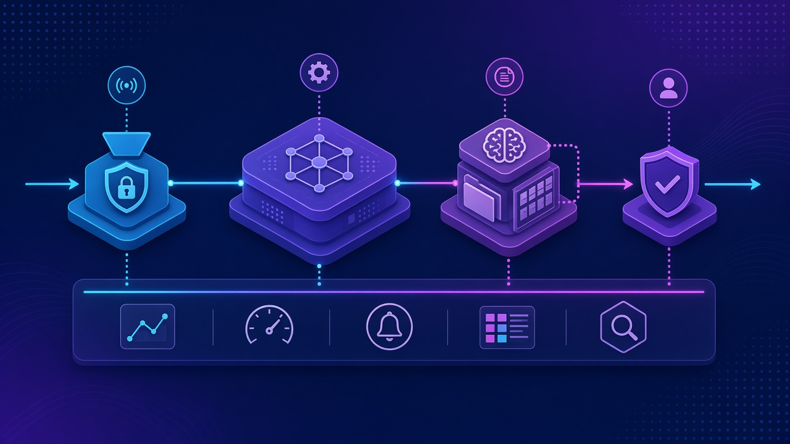
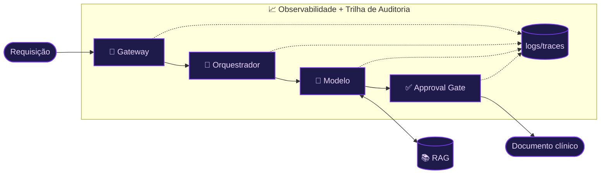
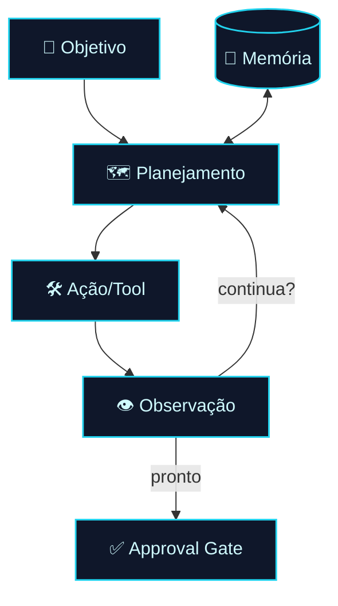
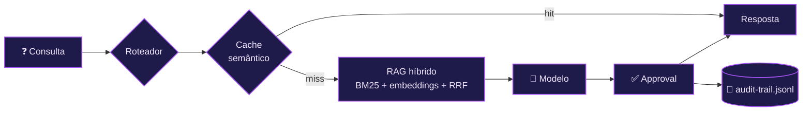
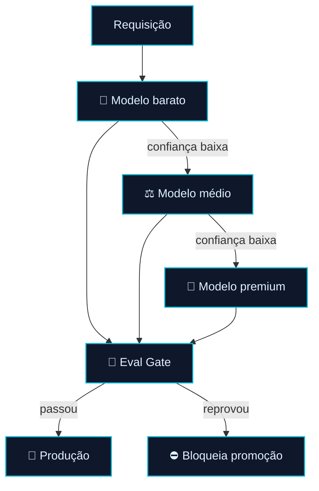

<!-- markdownlint-disable MD033 MD041 -->
<p align="center">
  
</p>

<p align="center">
  <a href="./modulo-07.md">⬅️ Anterior: Módulo 07</a> · <a href="./README.md">🏠 Índice</a> · <a href="./modulo-09.md">Próximo: Módulo 09 ➡️</a>
</p>

# 🏛️ Módulo 08 — Arquitetura de Sistemas com IA

> Os **padrões de arquitetura de referência** para sistemas de IA agêntica, construídos sobre o caso **TrialForge** (Vitalis Pharma, geração de documentos clínicos regulatórios) — do diagrama de referência a um protótipo enterprise com *model tiering* e trilha de auditoria.

<sub>👨‍🏫 Professor: Dr. José Ahirton Batista Lopes Filho · Pasta: [`modulo08-arquitetura-de-sistemas-com-ia/`](../modulo08-arquitetura-de-sistemas-com-ia/) · Runtime padrão: **Ollama** (`gemma4:e2b`), com **paridade JS + Python**</sub>

## 🧭 Neste capítulo

- [O diagrama de referência](#o-diagrama-de-referência)
- [8.1 — Fundamentos AI-First](#81--fundamentos-ai-first)
- [8.2 — Single-Agent](#82--single-agent)
- [8.3 — Multi-Agent](#83--multi-agent)
- [8.4 — Padrões AI-específicos](#84--padrões-ai-específicos)
- [8.5 — Arquitetura Enterprise](#85--arquitetura-enterprise)
- [🧪 Mão na massa](#-mão-na-massa)

## 🎯 Objetivos de aprendizagem

- Decidir entre **regra determinística, agente e approval gate** com um framework explícito.
- Dominar a **anatomia de um agente** e o loop **ReAct** com ferramentas tipadas.
- Escolher entre **6 padrões de orquestração** multiagente e tratar falha distribuída (CAP + Saga).
- Aplicar **RAG avançado**, roteamento de modelo, cache semântico e approval gate num gateway único.
- Projetar uma **arquitetura enterprise**: model tiering em cascata, eval gate e guardrails.

---

## O diagrama de referência

Todo o módulo se apoia no fluxo: **Gateway → Orquestrador → Modelo + RAG → Approval Gate**, com uma banda de **Observabilidade** por baixo.



> [!IMPORTANT]
> **Setup padrão (local, sem chave):**
> ```sh
> ollama pull gemma4:e2b        # + nomic-embed-text e gemma4:latest nos módulos 4 e 5
> cd modulo-0X-... && npm install
> node <prototipo>.js           # ou: python3 <prototipo>.py
> ```
> Alternativas pagas em `provedores-pagos.js/.py` (`ANTHROPIC_API_KEY`, `GEMINI_API_KEY`, `OPENAI_API_KEY`).

---

## 8.1 — Fundamentos AI-First

Nem tudo precisa de um agente. O módulo abre com uma **árvore de decisão de três perguntas** (determinístico vs. agente vs. approval gate) e uma ferramenta **executável em código puro** (sem rede) — o contraste perfeito com os agentes LLM que vêm depois.

| | |
|---|---|
| 📁 Pasta | [`modulo-01-fundamentos-ai-first/`](../modulo08-arquitetura-de-sistemas-com-ia/modulo-01-fundamentos-ai-first/) |
| 🗂️ Canvases | `reference-architecture-canvas.md`, `ai-first-architecture-canvas.md`, `decision-framework-checklist.md` |
| ▶️ Rodar | `node decision-framework-tool.js` · `python3 decision_framework_tool.py` (sem rede) |

---

## 8.2 — Single-Agent

A anatomia de um agente: **memória, planejamento, ferramentas, ação e approval gate**. O protótipo escreve uma seção **ICF** (Informed Consent Form) usando o loop **ReAct** com um schema de ferramenta tipado.



| | |
|---|---|
| 📁 Pasta | [`modulo-02-single-agent/`](../modulo08-arquitetura-de-sistemas-com-ia/modulo-02-single-agent/) |
| ▶️ Rodar | `npm install && node agent-components-demo.js` · `node react-agent-prototype.js` |
| 🔑 Requer | Ollama + `ollama pull gemma4:e2b` |

---

## 8.3 — Multi-Agent

Quando vale a pena ter vários agentes? O módulo apresenta **6 padrões de orquestração** e o tratamento de **falha distribuída**.

| Padrão | Ideia |
|--------|------|
| Sequential | Um após o outro |
| Parallel | Em paralelo, agrega no fim |
| Supervisor | Um coordena os demais |
| Hierarchical | Camadas de coordenação |
| Group Chat | Agentes "conversam" |
| Handoff | Passagem de bastão |

O protótipo usa uma **fila de mensagens assíncrona** (EventEmitter, sem LLM) entre agentes de Protocol / ICF / CSR / Supervisor, com *timeout*, *retry*, idempotência e regeneração compensatória (**CAP + Saga**).

| | |
|---|---|
| 📁 Pasta | [`modulo-03-multi-agent/`](../modulo08-arquitetura-de-sistemas-com-ia/modulo-03-multi-agent/) |
| ▶️ Rodar | `node trialforge-message-queue-prototype.js` (sem LLM) |

---

## 8.4 — Padrões AI-específicos

O coração técnico: **RAG avançado** (multi-índice híbrido = BM25 + embeddings + RRF), *retrieval* agêntico, roteamento de modelo, **cache semântico**, *streaming*, aprovação HITL e **trilha de auditoria** — tudo combinado em um **gateway** único.



| | |
|---|---|
| 📁 Pasta | [`modulo-04-padroes-ai-especificos/`](../modulo08-arquitetura-de-sistemas-com-ia/modulo-04-padroes-ai-especificos/) |
| ▶️ Rodar | `npm install && node trialforge-gateway-prototype.js` |
| 🔑 Requer | Ollama: `nomic-embed-text`, `gemma4:e2b`, `gemma4:latest` |
| 📝 Referência | compare com `audit-trail.jsonl` |

---

## 8.5 — Arquitetura Enterprise

O *capstone* de arquitetura: **model tiering em cascata** (estilo FrugalGPT, com confiança de busca e de resposta), um **eval gate** antes da promoção e um **guardrail** contra manipulação pré-geração.



| | |
|---|---|
| 📁 Pasta | [`modulo-05-arquitetura-enterprise/`](../modulo08-arquitetura-de-sistemas-com-ia/modulo-05-arquitetura-enterprise/) |
| ▶️ Rodar | `npm install && node trialforge-model-tiering-prototype.js` (+ `model-eval-gate-prototype.js`, `manipulation-guardrail-prototype.js`) |
| 📝 Referência | `audit-trail-tiering.jsonl` |

---

## 🧪 Mão na massa

1. **Decida:** rode o `decision-framework-tool` e classifique 3 casos do TrialForge como regra/agente/approval.
2. **ReAct:** rode o `react-agent-prototype` e leia o trace do loop até o approval gate.
3. **Orquestre:** no módulo 3, force um *timeout* na fila e observe o retry/compensação.
4. **RAG:** rode o gateway do módulo 4 e compare a resposta com o `audit-trail.jsonl`.
5. **Tiering:** no módulo 5, baixe o limiar de confiança e veja a cascata escalar para o modelo premium.

---

## 📚 Recursos e leituras

- [ReAct (Yao et al., 2023)](https://arxiv.org/abs/2210.03629) · [RAG (Lewis et al., 2020)](https://arxiv.org/abs/2005.11401)
- [CAP Theorem](https://en.wikipedia.org/wiki/CAP_theorem) · [Model Context Protocol](https://modelcontextprotocol.io/) · [A2A Protocol](https://a2a-protocol.org/)
- [Why AI Projects Fail (RAND, 2025)](https://www.rand.org/pubs/research_reports/RRA2680-1.html)
- [Ollama](https://ollama.com/)

---

<p align="center">
  <a href="./modulo-07.md">⬅️ Módulo 07</a> · <a href="./README.md">🏠 Índice</a> · <a href="./modulo-09.md">Próximo: Módulo 09 — Fine-Tuning ➡️</a>
</p>
