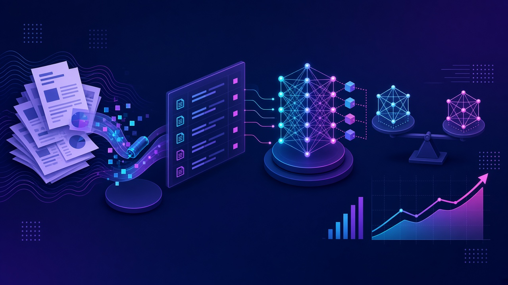
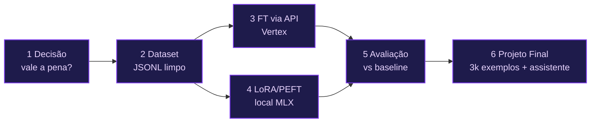
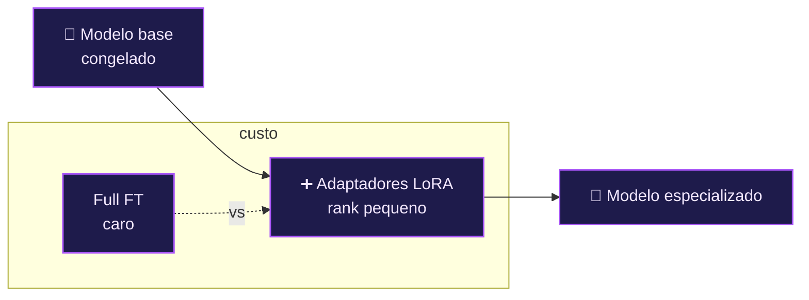
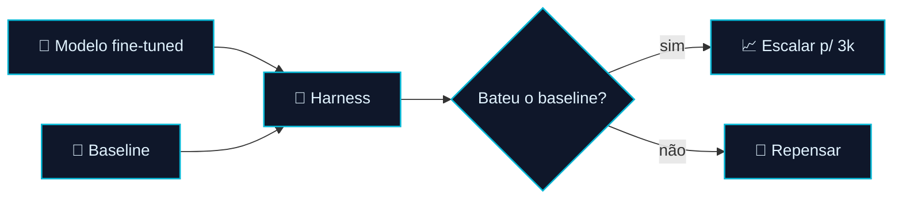

<!-- markdownlint-disable MD033 MD041 -->

  

  <a href="./modulo-08.md">⬅️ Anterior: Módulo 08</a> · <a href="./README.md">🏠 Índice</a>

# 🧬 Módulo 09 — Processamento de Dados e Fine-Tuning de Modelos

> O ciclo completo de fine-tuning sobre o caso **Amplitude Seguros** (seguradora fictícia, linhas Auto e Saúde Empresarial): da decisão *"vale a pena fazer fine-tuning?"* até um **modelo customizado real**, treinado, avaliado e documentado.

👨‍🏫 Professor: Dr. José Ahirton Batista Lopes Filho · Pasta: [`modulo09-processamento-de-dados-e-fine-tuning-de-modelos/`](../modulo09-processamento-de-dados-e-fine-tuning-de-modelos/) · Caminhos: **Vertex AI** (gerenciado) e **MLX-LM** (local) · **paridade JS + Python**

## 🧭 Neste capítulo

- [O ciclo de fine-tuning](#o-ciclo-de-fine-tuning)
- [9.1 — Decision Framework](#91--decision-framework)
- [9.2 — Preparação de Datasets](#92--preparação-de-datasets)
- [9.3 — Fine-Tuning via API (Vertex)](#93--fine-tuning-via-api-vertex)
- [9.4 — LoRA e PEFT](#94--lora-e-peft)
- [9.5 — Avaliação de Modelos](#95--avaliação-de-modelos)
- [9.6 — Projeto Final](#96--projeto-final)
- [🧪 Mão na massa](#-mão-na-massa)

## 🎯 Objetivos de aprendizagem

- Decidir **fine-tuning vs. RAG/prompt** com framework financeiro (4 perguntas, AHP, NPV).
- Construir datasets **JSONL** limpos, deduplicados, balanceados e **sem PII**.
- Rodar **fine-tuning gerenciado** (Vertex AI) e **local** (LoRA/PEFT com MLX).
- **Avaliar** o modelo customizado contra baselines e decidir se vale escalar.
- Entregar um **assistente de produção** que roteia por domínio e recusa fora de escopo.

---

## O ciclo de fine-tuning

> [!NOTE]
> **Companions do curso** (raiz do módulo): [casos de mercado](../modulo09-processamento-de-dados-e-fine-tuning-de-modelos/casos-de-mercado-fine-tuning-companion.md), [disponibilidade por provedor](../modulo09-processamento-de-dados-e-fine-tuning-de-modelos/disponibilidade-fine-tuning-provedores-companion.md), [risco/validade do modelo](../modulo09-processamento-de-dados-e-fine-tuning-de-modelos/risco-validade-modelo-companion.md) e [histórico](../modulo09-processamento-de-dados-e-fine-tuning-de-modelos/historico-fine-tuning-companion.md).

### Variáveis de ambiente (caminho Vertex)

| Variável | Uso |
|----------|-----|
| `GCP_PROJECT_ID` | Extração multimodal (M2) e scripts M3/M5 |
| `TUNING_JOB_NAME` | Upload/hiperparâmetros/automação/versionamento (M3) |
| `ENDPOINT_MODULO32` | Harness de avaliação (M5) e assistente (M6) — modelo de 200 exemplos |
| `ENDPOINT_MODULO63` | Verificação do modelo escalado (M6) — 3.000 exemplos |
| `ENDPOINT_AUTO_ONLY` / `ENDPOINT_SAUDE_ONLY` | Ablação por domínio (M5.2, opcional) |

Caminho local: **MLX-LM** (`python3 -m mlx_lm lora`) em Apple Silicon, com notebooks Colab como alternativa.

---

## 9.1 — Decision Framework

Fine-tuning é caro. Antes de treinar, responda **4 perguntas** e quantifique com **AHP**, **NPV**, Monte Carlo e opções reais. Inclui um *cheatsheet* dos 6–7 tipos de fine-tuning e uma demo de **GRPO** (recompensa verificável, sem treinar).

| | |
|---|---|
| 📁 Pasta | [`modulo-01-decision-framework/`](../modulo09-processamento-de-dados-e-fine-tuning-de-modelos/modulo-01-decision-framework/) |
| ▶️ Rodar | `node decision-framework-tool.js` · `python3 decision_framework_tool.py` · `node grpo-verifiable-reward-demo.js` (Ollama) |
| 📥 Dados | `amplitude-seguros-casos.json`, `fine-tuning-types-cheatsheet.md` |

---

## 9.2 — Preparação de Datasets

O gargalo real do fine-tuning é **dado**. Aqui: **OCR → JSONL**, *gate* de **PII**, deduplicação **MinHash+LSH**, balanceamento e um comparativo **OCR vs. LLM multimodal**.

| | |
|---|---|
| 📁 Pasta | [`modulo-02-preparacao-datasets/`](../modulo09-processamento-de-dados-e-fine-tuning-de-modelos/modulo-02-preparacao-datasets/) |
| ▶️ Rodar | `node extraction-to-jsonl-tool.js` (requer **`tesseract`** + idioma `por`); demais tools: `node <tool>.js` ou `python3 <tool>.py` |
| 🔑 Requer | Caminho multimodal: `GCP_PROJECT_ID` + Vertex; caminho OCR: só Tesseract local |
| 📄 Saída | `dataset-amplitude-seguros.jsonl` |

---

## 9.3 — Fine-Tuning via API (Vertex)

Fine-tuning **supervisionado gerenciado** no Vertex AI: upload, jobs, hiperparâmetros, automação, versionamento e *model cards*. Inclui a reavaliação da linha **Saúde Empresarial** contra o framework do M1.

| | |
|---|---|
| 📁 Pasta | [`modulo-03-fine-tuning-via-api/`](../modulo09-processamento-de-dados-e-fine-tuning-de-modelos/modulo-03-fine-tuning-via-api/) |
| ▶️ Rodar | `node dataset-upload-and-tracking-tool.js`, `hyperparameter-and-monitoring-tool.js`, `finetuning-automation-tool.js`, `model-versioning-tool.js` (mirrors `*_tool.py`) |
| 🔑 Requer | `TUNING_JOB_NAME`, `GCP_PROJECT_ID`, GCP com billing e `gcloud auth` |
| 📘 Setup | `gcp-setup-companion.md` |

---

## 9.4 — LoRA e PEFT

Treinar **localmente e barato** com adaptadores. Compara **full fine-tuning vs. LoRA**, os *ranks* 4/8/16, **DoRA/QLoRA** e a economia **cloud vs. regional**.

| | |
|---|---|
| 📁 Pasta | [`modulo-04-lora-e-peft/`](../modulo09-processamento-de-dados-e-fine-tuning-de-modelos/modulo-04-lora-e-peft/) |
| ▶️ Rodar | `node local-lora-training-tool.js` (chama `python3 -m mlx_lm lora`); tools de comparação (`adapter-comparison-tool.js`, `rank-adapter-comparison-tool.js`) |
| 🔑 Requer | **MLX-LM** + Apple Silicon (ou Colab/CUDA); pesos MLX **não** versionados (ver README) |

---

## 9.5 — Avaliação de Modelos

Sem avaliação, fine-tuning é fé. O **harness** roda contra um *test set* separado, compara com o baseline, mede *trade-off* por domínio, testa **overfitting/estresse** e confronta **NPV real vs. projetado**.

| | |
|---|---|
| 📁 Pasta | [`modulo-05-avaliacao-modelos/`](../modulo09-processamento-de-dados-e-fine-tuning-de-modelos/modulo-05-avaliacao-modelos/) |
| ▶️ Rodar | `export ENDPOINT_MODULO32=... && node model-evaluation-harness-tool.js`; `node veredito-escala-tool.js`; `node avaliacao-modelo-local-tool.js` (MLX) |
| 🔑 Requer | `ENDPOINT_MODULO32`, `GCP_PROJECT_ID` (harness cloud); local: adaptadores MLX |
| 📊 Saída | `resultado-medido.json` |

---

## 9.6 — Projeto Final

O fechamento do ciclo: dataset de produção **escalado (200 → 3.000 exemplos)**, novo job, **reavaliação** contra o mesmo harness do M5, um **assistente** que roteia por domínio e **recusa** entradas fora de escopo, e um documento de **decisões de arquitetura**.

| | |
|---|---|
| 📁 Pasta | [`modulo-06-projeto-final/`](../modulo09-processamento-de-dados-e-fine-tuning-de-modelos/modulo-06-projeto-final/) |
| ▶️ Rodar | `node m6-dataset-scaling-tool.js`; `ENDPOINT_MODULO32=... ENDPOINT_MODULO63=... node m6-scaled-model-verification-tool.js`; `node amplitude-seguros-assistente.js "<texto>"` ou `--local` |
| 📄 Docs | `decisoes-de-arquitetura.md`, `guia-reavaliacao-pos-escala.md`, `guia-geracao-sintetica-via-llm.md` |
| 📄 Dataset | `amplitude-seguros-dataset-producao-3000.jsonl` |

---

## 📖 Leituras recomendadas

- [LoRA (Hu et al., 2021)](https://arxiv.org/abs/2106.09685) · [QLoRA (Dettmers et al., 2023)](https://arxiv.org/abs/2305.14314)
- [Deduplicating Training Data Makes LMs Better (Lee et al.)](https://arxiv.org/abs/2107.06499)
- [The Analytic Hierarchy Process (Saaty, 1980)](https://archive.org/details/analytichierarch0000saat)

---

## 🧪 Mão na massa

1. **Decida:** rode o `decision-framework-tool` nos 3 casos da Amplitude e justifique fine-tuning vs. RAG.
2. **Prepare:** gere `dataset-amplitude-seguros.jsonl` e rode o *gate* de PII — algum dado sensível vazou?
3. **Avalie:** com um `ENDPOINT_MODULO32`, rode o harness e leia `resultado-medido.json`.
4. **Escale?** rode o `veredito-escala-tool.js` e decida se os 3k exemplos se pagam.
5. **Assistente:** rode `amplitude-seguros-assistente.js --local` e mande um texto fora de escopo — ele recusa?

---

## 📚 Ferramentas & Plataformas

- [Vertex AI](https://cloud.google.com/vertex-ai) · [Microsoft Presidio](https://microsoft.github.io/presidio/) · [Tesseract OCR](https://github.com/tesseract-ocr/tesseract) · [MLX](https://github.com/ml-explore/mlx)

---

  <a href="./modulo-08.md">⬅️ Módulo 08</a> · <a href="./README.md">🏠 Índice</a>

🎉 Fim do manual expandido. Bons estudos!

