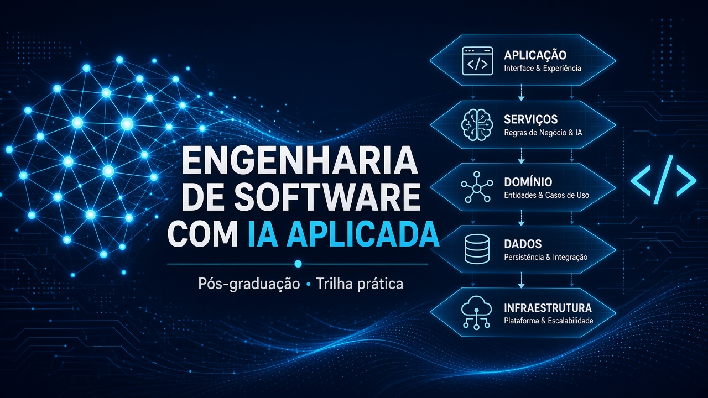

# Engenharia de Software com IA Aplicada — pacote do curso

Este diretório é o **ponto de entrada oficial** da pós-graduação neste repositório. Os módulos, labs e exemplos já existiam; aqui eles viram uma trilha ensinável, com ordem, critérios e mapa do que o aluno faz em cada pasta.

Vídeos de aula **não** estão neste repositório. O código, os prompts, os canvases e os labs são o material de estudo. Licença: [CC BY-NC-ND 4.0](../LICENSE.md) — uso para estudo, sem uso comercial.

## Mídia

Capas do curso e dos nove módulos, mais o índice de vídeos HeyGen (IDs da conta, sem arquivo de playback no Git): [media/README.md](./media/README.md).

## Conteúdo das aulas

O texto didático (aula completa, roteiro de narração e metadados) está em [`conteudo/`](./conteudo/README.md). Os guias em [`modulos/`](./modulos/) continuam sendo o mapa operacional — objetivos, labs, checklist. Leia a aula, depois execute o lab.

## Preview local

Para abrir o pacote no navegador (sidebar, markdown, capas e índice de mídia): [preview/README.md](./preview/README.md).

## Público-alvo

- Pessoas desenvolvedoras (web/backend) que já escrevem software e querem **projetar, integrar e operar** sistemas com LLMs, agentes, MCP, RAG e AIOps.
- Tech leads, arquitetas/os e engenheiras/os de plataforma que precisam decidir *quando* um agente, um fine-tune ou um RAG vale a pena — e como governar isso.
- Não é um curso de ciência de dados clássico nem de “prompt para leigos”: o eixo é **engenharia de software com IA aplicada**.

## Pré-requisitos

Antes do Módulo 01:

- Git, terminal e um editor com agentes (Cursor, VS Code + Copilot, ou equivalente).
- JavaScript/TypeScript confortável (Node.js **22** recomendado; vários labs exigem ≥ 20).
- HTTP, JSON e GitHub no nível de uso diário.

Antes dos módulos avançados (vão aparecendo na trilha):

- Python 3.10–3.13 (Módulos 06 e 09; paridade JS/Python nos 07–09).
- Docker / `docker compose` (Neo4j, MongoDB, Grafana, Postgres).
- Conta [OpenRouter](https://openrouter.ai/) (vários labs de 01–04; modelos `:free` existem).
- Chrome atualizado para Web AI / Prompt API (Módulo 01).
- Groq (Módulo 06), Google AI Studio (05 e 07), Ollama local (01, 08, trechos do 09), Vertex AI opcional (09).

Windows nativo: leia [guia-do-aluno.md](./guia-do-aluno.md) e use [`troubleshooting/`](../troubleshooting/) + skill [`windowsfy`](../skills/windowsfy/SKILL.md). WSL é o caminho mais estável.

## Carga horária sugerida

**240 horas** de estudo dirigido (teoria + labs + projetos de módulo), alinhada a uma disciplina de pós-graduação. Distribuição em [trilha-aprendizado.md](./trilha-aprendizado.md).

| Bloco | Horas | O que cobre |
| --- | --- | --- |
| Fundamentos e integração (M01–M03) | 84 h | Web ML, LLMs, prompts, MCP, APIs, RAG |
| Agentes e produto (M04–M05) | 56 h | OpsPilot, Copilot/SDD, UI/UX com IA |
| Operação, gestão e arquitetura (M06–M08) | 68 h | Nexus AIOps, RouteWise, TrialForge |
| Dados e fine-tuning (M09) | 28 h | Amplitude Seguros |
| Lives e integração | 4 h | MCP/skills, Spec-Driven Development, Safer |

Quem já programa com LangChain/MCP pode comprimir M02–M03; quem nunca treinou modelo deve reservar as 28 h do M09 (há caminho Colab sem Mac).

## Competências de saída

Ao completar a trilha, a pessoa deve conseguir:

1. **Rodar e comparar** inferência no navegador, local (Ollama) e via gateway (OpenRouter), calibrando temperatura/top-K e custo.
2. **Projetar prompts e contexto** (JSON/TOON, system instructions, orçamento de tokens) e defender a escolha com evidência do lab.
3. **Integrar LLMs em APIs** (roteamento de modelo, LangGraph, memória, guardrails contra prompt injection).
4. **Expor e consumir MCP**: tools, resources, prompts, autenticação e publicação em registry privado.
5. **Construir um agente de produção incremental** (ReAct, tools, memória semântica, LangGraph, HITL, multiagente) — o caso é o **OpsPilot**.
6. **Operar o ciclo discovery → código → E2E** com IA (Pix / CFP Platform / BragBot).
7. **Aplicar AIOps agêntica** sob governança (IaC, K8s, FinOps, Trivy, RAG de runbook) — o caso é o **Nexus**.
8. **Gerir um projeto com IA** sem entregar o critério humano: RICE/WSJF, PERT+Monte Carlo, compliance como código — o caso é o **RouteWise**.
9. **Desenhar arquitetura AI-first** (agente vs regra, RAG avançado, Approval Gate, model tiering) — o caso é o **TrialForge**.
10. **Decidir e executar fine-tuning** (AHP/NPV, JSONL, LoRA/PEFT, harness de avaliação) — o caso é a **Amplitude Seguros**.

## Como usar este repositório

| Papel | Comece em | Depois |
| --- | --- | --- |
| Aluno novo | Este arquivo → [guia-do-aluno.md](./guia-do-aluno.md) | [trilha-aprendizado.md](./trilha-aprendizado.md) e o guia do módulo atual em [`modulos/`](./modulos/) |
| Instrutor | [guia-do-instrutor.md](./guia-do-instrutor.md) | [syllabus.md](./syllabus.md) + [avaliacao.md](./avaliacao.md) |
| “Onde fica o lab X?” | [mapa-do-repositorio.md](./mapa-do-repositorio.md) | Pasta real do módulo |
| Termo desconhecido | [glossario.md](./glossario.md) | — |
| Material incompleto | [lacunas-e-proximos-passos.md](./lacunas-e-proximos-passos.md) | Não invente o que não está no disco |

Convenção de pastas usada em vários labs dos Módulos 01–03:

- `*-template` — ponto de partida (stubs). **Trabalhe aqui.**
- `*-z` — gabarito da aula. Consulte depois de tentar, não antes.

Os Módulos 04–09 são casos cumulativos (snapshots ou ferramentas por unidade), não pares template/gabarito.

## Índice do pacote

| Arquivo | Função |
| --- | --- |
| [syllabus.md](./syllabus.md) | Ementa, objetivos, conteúdo, bibliografia, avaliação |
| [trilha-aprendizado.md](./trilha-aprendizado.md) | Sequência, dependências, tempo por unidade |
| [mapa-do-repositorio.md](./mapa-do-repositorio.md) | Pasta → aula/lab → o que o aluno faz |
| [avaliacao.md](./avaliacao.md) | Rubricas, checkpoints, projetos finais |
| [guia-do-instrutor.md](./guia-do-instrutor.md) | Como conduzir, ênfases, traps, ordem das demos |
| [guia-do-aluno.md](./guia-do-aluno.md) | Setup, ritmo, estudo, troubleshooting |
| [glossario.md](./glossario.md) | Termos-chave da trilha |
| [lacunas-e-proximos-passos.md](./lacunas-e-proximos-passos.md) | O que falta no material (honesto) |
| [modulos/01.md](./modulos/01.md) … [09.md](./modulos/09.md) | Guia ensinável de cada módulo |
| [conteudo/README.md](./conteudo/README.md) | Texto das aulas, roteiros de narração e `meta.json` |
| [media/README.md](./media/README.md) | Capas e IDs dos vídeos HeyGen |
| [preview/README.md](./preview/README.md) | Preview local do pacote no navegador |

## Os nove módulos

| # | Foco | Pasta no repo | Projeto âncora |
| --- | --- | --- | --- |
| 01 | Fundamentos de IA e LLMs | [`modulo01-fundamentos-de-ia-e-llms-para-programadores/`](../modulo01-fundamentos-de-ia-e-llms-para-programadores/) | Recomendação TF.js, Duck Hunt, RAG Neo4j |
| 02 | Integração de APIs de LLMs | [`modulo02-integracao-apis-llms/`](../modulo02-integracao-apis-llms/) | Gateway, consultas médicas, RAG Cypher |
| 03 | MCP na prática | [`modulo03-mcp-na-pratica/`](../modulo03-mcp-na-pratica/) | CipherSuite MCP, customers MCP, registry |
| 04 | Agentes autônomos | [`modulo04-criacao-de-agentes-autonomos-novo/`](../modulo04-criacao-de-agentes-autonomos-novo/) | Notas API + **OpsPilot** |
| 05 | IA para UI/UX | [`modulo05-ferramentas-de-IA-para-UI-UX/`](../modulo05-ferramentas-de-IA-para-UI-UX/) | Pix App, CFP Platform, BragBot |
| 06 | AIOps / engenharia agêntica | [`modulo06-aiops-engenharia-agentica/`](../modulo06-aiops-engenharia-agentica/) | **Nexus** (12 labs) |
| 07 | Gestão de projetos com IA | [`modulo07-ferramentas-de-ia-para-gestao-de-projetos/`](../modulo07-ferramentas-de-ia-para-gestao-de-projetos/) | **RouteWise** (10 ferramentas) |
| 08 | Arquitetura de sistemas com IA | [`modulo08-arquitetura-de-sistemas-com-ia/`](../modulo08-arquitetura-de-sistemas-com-ia/) | **TrialForge** |
| 09 | Dados e fine-tuning | [`modulo09-processamento-de-dados-e-fine-tuning-de-modelos/`](../modulo09-processamento-de-dados-e-fine-tuning-de-modelos/) | **Amplitude Seguros** |

Links extras de aula (vídeos, papers, ferramentas) continuam no [README da raiz](../README.md), agora com esta pasta como entrada.

## Material complementar (não substitui os módulos)

- Lives: [`lives/2026-02-24/`](../lives/2026-02-24/) (MCP e Agent Skills), [`lives/2026-05-27/`](../lives/2026-05-27/) (Spec-Driven Development), [`lives/2026-07-28/`](../lives/2026-07-28/) (Safer).
- Troubleshooting: [`troubleshooting/`](../troubleshooting/).
- Skill Windows: [`skills/windowsfy/`](../skills/windowsfy/).
- `embaixadores/` está vazia neste clone (só `.gitkeep`).
