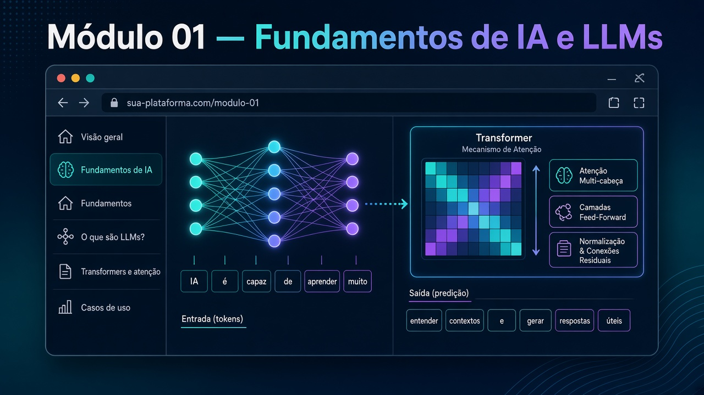

# Módulo 01 — Fundamentos de IA e LLMs para programadores



Pasta: [`modulo01-fundamentos-de-ia-e-llms-para-programadores/`](../../modulo01-fundamentos-de-ia-e-llms-para-programadores/)  
Índice de links de aula: [README da raiz](../../README.md) (não há README nesta pasta).  
Carga: ~36 h. Trilha: [trilha-aprendizado.md](../trilha-aprendizado.md).  
Anterior: [README do curso](../README.md) · Próximo: [Módulo 02](./02.md)

## Por que este módulo existe

O restante da pós assume que você já **rodou** um modelo — no Node, no navegador e via API — e que sabe dizer *onde* a inteligência está. Sem isso, MCP vira “mais um JSON”, RAG vira “busca mágica” e o OpsPilot vira um chatbot. Este capítulo constrói o vocabulário de engenharia: tensor, época, token, temperatura, tool, embedding, retrieval.

Não é um curso de ciência de dados. A pergunta de cada aula é: **o que o código faz com o modelo, e o que você ainda decide?**

```text
IA (campo) → ML (aprende com dados) → Deep Learning (redes) → LLM (texto)
                 │
                 ├─ no cliente (TF.js, YOLO, Prompt API)
                 ├─ local (Ollama)
                 └─ nuvem (OpenRouter)
```

## Como estudar este capítulo

1. Leia a seção **A ideia** antes de abrir a pasta.
2. Trabalhe no **template**; abra o `-z` só depois de uma tentativa.
3. Anote uma frase por lab: *o modelo está no browser, no processo Node, ou atrás de HTTP?*
4. Teoria extra: links do [README da raiz](../../README.md). Este guia não inventa URLs.

## Objetivos de aprendizagem

Ao concluir, você será capaz de:

1. Treinar e **executar** uma rede pequena no Node (`tfjs-node`) e um recomendador **no navegador** (TF.js worker).
2. Explicar a diferença entre modelo no cliente (visão/YOLO), Prompt API no Chrome e LLM via API.
3. Calibrar **temperature** e **top-K** e descrever o efeito numa geração real.
4. Escrever um prompt com saída estruturada (JSON/TOON) e usá-lo num agente de código.
5. Configurar pelo menos um servidor **MCP** (Playwright, Context7 ou Grafana) e completar a tarefa do prompt da pasta.
6. Comparar a **mesma** chamada em Ollama local e OpenRouter.
7. Indexar um PDF em Neo4j (embeddings) e responder com **RAG** (retrieval visível).

## Conceitos que você precisa internalizar

| Conceito | Em uma frase | Onde sente no código |
| --- | --- | --- |
| **Época** | Uma passagem completa pelo conjunto de treino. | `model.fit({ epochs: 100 })` no exemplo 00 |
| **Loss** | Distância entre o que o modelo prevê e o rótulo certo. | `categoricalCrossentropy` |
| **Softmax** | Transforma scores em probabilidades que somam 1. | última camada do classificador |
| **Worker** | Thread à parte para não travar a UI. | `modelTrainingWorker.js` no e-commerce |
| **Token** | Pedaço de texto que o LLM conta e cobra. | tokenizer (README §6) |
| **Temperature** | Quão “surpresa” é a amostragem do próximo token. | sliders do exemplo 04 |
| **Embedding** | Vetor que representa um trecho; similaridade ≈ proximidade. | exemplo 12 |
| **RAG** | Recupera trechos **e só então** pede ao LLM para gerar. | exemplo 13; paper Lewis et al. |
| **MCP** | Contrato USB-C: host ↔ servidor de tools/resources/prompts. | exemplos 06–09; [glossário](../glossario.md) |

## Pré-requisitos

- Node 22, npm, Chrome, Docker Compose v2.
- Conta OpenRouter a partir dos exemplos 11–13.
- Ollama para o exemplo 10.
- Windows: [guia-do-aluno.md](../guia-do-aluno.md) + [`troubleshooting/windows/commons.md`](../../troubleshooting/windows/commons.md) (`tfjs-node`).

## Roteiro de aulas

### Aula 1.1 — Introdução e Teachable Machine (~2 h)

**A ideia.** Inteligência Artificial é o guarda-chuva; Machine Learning é o subconjunto que **ajusta parâmetros a partir de dados**; Deep Learning usa redes com várias camadas. Antes de escrever um `tf.layers.dense`, vale *sentir* o ciclo: coletar exemplos → treinar → exportar → inferir.

Só links no [README da raiz](../../README.md) (Pacman TF.js, Wear, Teachable Machine, Kaggle Titanic, Lobe). **Não há pasta.** Treine um modelo de imagem no [Teachable Machine](https://teachablemachine.withgoogle.com/) e, se quiser, exporte para o browser.

**Saída.** Você descreve, em uma frase cada: o que é um exemplo de treino, o que o modelo devolve na inferência, e por que mais dados ≠ automaticamente melhor modelo.

### Aula 1.2 — ML / DL / IA (~2 h)

**A ideia.** Uma rede densa é uma composição de matrizes + não-linearidade. Sem a não-linearidade (ReLU, etc.), empilhar camadas não aumenta o poder expressivo. “Época”, “loss” e “camada” não são jargão de paper: são o que você vai ler no log do `model.fit`.

Links: anatomia de rede, SensorLM. Sem código no repo.

**Saída.** Defina época, loss e camada em uma frase cada — e diga o que acontece se você treinar 100 épocas num dataset de 20 linhas (overfit).

### Aula 1.3 — Deep learning na prática (~6 h)

**A ideia.** Agora o vocabulário vira código. No classificador Node, cada pessoa vira um vetor de 7 posições (idade + cor + localização); a rede termina em 3 neurônios (premium / medium / basic). No e-commerce, o **mesmo tipo de rede** roda num Web Worker: a UI não congela enquanto `model.fit` corre.

Trabalhe no **template**; abra `-z` depois.

| Momento | Pasta | Tipo |
| --- | --- | --- |
| Classificador Node | [`exemplo-00-template/`](../../modulo01-fundamentos-de-ia-e-llms-para-programadores/exemplo-00-template/) | template — implemente `trainModel` |
| Gabarito | [`exemplo-00-z/`](../../modulo01-fundamentos-de-ia-e-llms-para-programadores/exemplo-00-z/) | `npm start` |
| E-commerce | [`exemplo-01-ecommerce-recomendations-template/`](../../modulo01-fundamentos-de-ia-e-llms-para-programadores/exemplo-01-ecommerce-recomendations-template/) | `npm start` → **:3000** |
| Snapshots | [`exemplo-01-ecommerce-recomendations-z/parte01-…`](../../modulo01-fundamentos-de-ia-e-llms-para-programadores/exemplo-01-ecommerce-recomendations-z/parte01-ecommerce-recomendations-with-tensorflow/) até `parte05-…` | só o worker muda |

**O que observar no e-commerce.** As cinco partes não são “versões do site”: o HTML quase não muda. Muda o `modelTrainingWorker.js`:

1. contexto de treino (e um `debugger`);
2. `encodeProduct`;
3. `encodeUser` + pares de treino;
4. `model.fit`;
5. `recommend` + evento `recommendationsReady`.

Visualizadores citados no README: CNN Explainer, GAN Lab, BertViz, Netron, TensorBoard.

**Armadilha.** O README do e-commerce às vezes cita porta 8080; o `npm start` deste lab sobe em **:3000**. Confie no `package.json`.

### Aula 1.4 — Web ML / Duck Hunt (~4 h)

**A ideia.** Inferência no cliente não é só recomendação: um modelo de **visão** (YOLOv5n em TF.js) lê o canvas, devolve bounding boxes e o jogo clica sozinho. Privacidade e latência melhoram; GPU fraca e tamanho do modelo pioram.

[`exemplo-02-vencendo-qualquer-jogo/`](../../modulo01-fundamentos-de-ia-e-llms-para-programadores/exemplo-02-vencendo-qualquer-jogo/): `_template/` → `DuckHunt-JS-parte01/` → `DuckHunt-JS-parte02/`. `npm start` (:8080). Modelo em `machine-learning/yolov5n_web_model/`.

**O que observar.** Na parte 01 o worker carrega o YOLO mas a predição ainda é didática/fixa; na parte 02 o clique usa o centro da box acima do limiar. Se a sala não tiver GPU, rode a parte 02 mesmo assim e explique o worker — não treine YOLO do zero (fora de escopo).

### Aula 1.5 — Algoritmos genéticos e RL (~2 h)

**A ideia.** Nem toda IA é backpropagation. Algoritmos genéticos **selecionam** soluções; RL **recompensa** ações no tempo. Você não implementa um treino aqui: o objetivo é não chamar “IA” só o que tem `model.fit`.

Só links (Genetic Cars, cart-pole TF.js, tic-tac-toe). Sem pasta. Opcional.

**Saída.** Uma frase contrastando neuroevolução e RL, com um exemplo de cada link.

### Aula 1.6 — Como LLMs funcionam (~2 h)

**A ideia.** Um LLM não “entende” no sentido humano: texto vira **tokens**, tokens viram **embeddings**, **attention** pondera o que importa para prever o **próximo** token. Custo e contexto nascem daí — por isso o tokenizer da OpenAI (link no README) é ferramenta de engenharia, não curiosidade.

Links de transformers/attention no README §5.2. Sem pasta.

**Saída.** Explique, para um colega backend, por que “o prompt ficou grande” pode ser um problema de tokens e não de “o modelo ficou burro”.

### Aula 1.7 — Web AI (~4 h)

**A ideia.** A Prompt API do Chrome tenta o inverso da aula 1.11: o modelo **no dispositivo** (Gemini Nano quando disponível). Sem chave, com privacidade, com restrição de hardware e flags. Temperature e top-K deixam de ser slides de paper: você mexe e o texto muda.

| Pasta | Foco |
| --- | --- |
| [`exemplo-03-webai01/`](../../modulo01-fundamentos-de-ia-e-llms-para-programadores/exemplo-03-webai01/) | `index.html` + Prompt API streaming |
| [`exemplo-04-webai02-temperature-and-topK/`](../../modulo01-fundamentos-de-ia-e-llms-para-programadores/exemplo-04-webai02-temperature-and-topK/) | sliders; `npm start` |
| [`exemplo-05-webai03-multimodal/`](../../modulo01-fundamentos-de-ia-e-llms-para-programadores/exemplo-05-webai03-multimodal/) | imagem/áudio; flags Chrome |

Se a API quebrar: [`troubleshooting/google.md`](../../troubleshooting/google.md). Isso **conta** como C01.2 se você documentar o bloqueio.

**Experimento obrigatório (exemplo 04).** A mesma pergunta em temperature ~0 e ~1. Anote: o que ficou estável? o que virou ruído?

### Aula 1.8 — Prompt engineering (~2 h)

**A ideia.** Prompt não é conversa: é **especificação**. Papel, contexto, formato de saída, restrições. JSON (e TOON, mais compacto em tokens) transformam “escreve um resumo” em contrato validável. O M05 e o M07 só funcionam se você já trata system prompt como artefato versionado.

README §6. Sem pasta de código. Tokenizer OpenAI, guias OpenAI/Anthropic/Claude, TOON ([toon-format](https://github.com/toon-format/toon) — link já no README).

**Saída.** Um prompt seu com saída JSON (campos nomeados) e a versão “solta” que você recusou.

### Aula 1.9 — Agentes de código (~1 h)

**A ideia.** Ask / Edit / Agent não são o mesmo modo. Agente de código **age** no repo; sem spec e sem guardrail de terminal, ele apaga o que você não queria. Esta aula é preparação mental para o M04 U1 (SDD), não um lab.

README §7 (Cursor, Copilot, Spec-Kit, worktrees). Sem pasta aqui.

### Aula 1.10 — MCP (~6 h)

**A ideia.** O LLM isolado não lê seu Grafana nem clica no browser. MCP padroniza **tools**, **resources** e **prompts** para o host (Cursor, VS Code, Claude Desktop). Você ainda não *escreve* o servidor (isso é o M03): aqui você **consome** servidores prontos para completar uma tarefa.

| Pasta | Foco |
| --- | --- |
| [`exemplo-06-playwright-testes/`](../../modulo01-fundamentos-de-ia-e-llms-para-programadores/exemplo-06-playwright-testes/) | `prompts/` + `example.mcp.json` — **gere** o projeto |
| [`exemplo-07-playwright-navegacao/`](../../modulo01-fundamentos-de-ia-e-llms-para-programadores/exemplo-07-playwright-navegacao/) | `prompt.md` — form **sem** submit |
| [`exemplo-08-context7/`](../../modulo01-fundamentos-de-ia-e-llms-para-programadores/exemplo-08-context7/) | `prompt.md` ou rode [`nextjs-better-auth-demo/`](../../modulo01-fundamentos-de-ia-e-llms-para-programadores/exemplo-08-context7/nextjs-better-auth-demo/) |
| [`exemplo-09-grafana-mcp/alumnus/`](../../modulo01-fundamentos-de-ia-e-llms-para-programadores/exemplo-09-grafana-mcp/alumnus/) | Docker + [`docs/grafana-mcp-prompts.md`](../../modulo01-fundamentos-de-ia-e-llms-para-programadores/exemplo-09-grafana-mcp/alumnus/docs/grafana-mcp-prompts.md) |

MCP de contribuições do README aponta para repositório externo `erickwendel-contributions-mcp` (não está neste clone).

**Como escolher.** Não precisa dos quatro no mesmo dia. Um fluxo completo (prompt colado + evidência) vale o checkpoint C01.3. Grafana é o mais pesado (Docker): suba a infra *antes* da sessão.

### Aula 1.11 — Open vs closed (~2 h)

**A ideia.** “Local vs nuvem” não é ideologia: é tabela de engenharia (custo, dado, qualidade, rate limit). A **mesma** pergunta nos dois lados revela recusa, estilo e latência. Você vai reusar essa comparação no M08.

[`exemplo-10-ollama/request.sh`](../../modulo01-fundamentos-de-ia-e-llms-para-programadores/exemplo-10-ollama/) e [`exemplo-11-openrouter/request.sh`](../../modulo01-fundamentos-de-ia-e-llms-para-programadores/exemplo-11-openrouter/). Crie `.env` no 11 (não há `.env.example`).

**Armadilha.** Sem `.env.example` no 11: copie a chave no formato que o `request.sh` espera. Typo `applicaton/json` no curl, se aparecer — o header correto é `application/json`.

### Aula 1.12 — RAG (~5 h)

**A ideia.** Um LLM sem retrieval inventa com confiança. RAG (Lewis et al., 2020 — link no README) quebra o problema em dois sistemas:

1. **Indexar:** PDF → chunks → embeddings → índice vetorial (Neo4j).
2. **Responder:** pergunta → embedding → top-k trechos → prompt com citação → LLM.

O exemplo 12 **só busca**. O 13 **gera**. Se você pular o 12, não vai saber se a alucinação veio do retrieval ou do modelo.

1. Template: [`exemplo-12-embeddings-neo4j-template/`](../../modulo01-fundamentos-de-ia-e-llms-para-programadores/exemplo-12-embeddings-neo4j-template/) — `script.txt`, `.env.example`, `docker compose`.
2. Gabarito embeddings: [`exemplo-12-embeddings-neo4j/`](../../modulo01-fundamentos-de-ia-e-llms-para-programadores/exemplo-12-embeddings-neo4j/).
3. RAG: [`exemplo-13-embeddings-neo4j-rag/`](../../modulo01-fundamentos-de-ia-e-llms-para-programadores/exemplo-13-embeddings-neo4j-rag/) (`src/ai.ts`, `prompts/`, `respostas/` depois).

**O que entregar.** Uma pergunta cuja resposta **está** no `tensores.pdf` (trechos visíveis) e uma pergunta cuja resposta **não** está — o que o sistema fez?

## Atividades práticas

1. Complete o template 00 até `model.fit` e uma predição; diff com o `-z`.
2. No e-commerce, treine o worker; compare `parte01` com `parte05` de `modelTrainingWorker.js`.
3. No exemplo 04, gere a mesma pergunta em temperature 0 e 1; anote.
4. Rode **um** dos MCPs 06–09 até o fim do prompt (não precisa dos quatro no mesmo dia).
5. No template 12, implemente o que `script.txt` lista; só então olhe o 12 completo e o 13.

## Erros comuns

- Abrir o `-z` “só para ver a estrutura” e copiar o treino inteiro. Teto de nota: [avaliacao.md](../avaliacao.md).
- Chamar de RAG um `curl` no OpenRouter sem chunks. RAG exige retrieval **visível**.
- Tratar Prompt API quebrada como falha pessoal. Documente flags/Chrome; é C01.2 válido.
- Pular 1.8 porque “já sei promptar”. O M05 cobra JSON de system prompt, não papo.

## Checklist de conclusão

- [ ] C01.1 — 00 ou 01 rodando
- [ ] C01.2 — Web AI **ou** fallback documentado
- [ ] C01.3 — um MCP com o prompt colado
- [ ] C01.4 — RAG com pergunta + trechos
- [ ] Sei a convenção template vs `-z`
- [ ] Consigo apontar, em cada lab que rodei, se o modelo está no cliente, local ou na API

## Leituras

**Obrigatórias:** README raiz seções 1.3, 1.4, 5.3–5.4, 8, 9, 10; `script.txt` do exemplo 12; paper RAG ([arxiv 2005.11401](https://arxiv.org/pdf/2005.11401) — já no README).  
**Opcionais:** demais links de 1.1, 1.2, 5.1, 5.2, 6, 7; `refs.txt` do e-commerce; TOON playground.

## Projeto / desafio do módulo

Monte o pipeline **12 → 13** (template preenchido ou fork do 13) e entregue: comando para subir Neo4j, uma pergunta, os ids/trechos recuperados, a resposta do LLM, e 10 linhas comparando Ollama vs OpenRouter para o mesmo prompt do exemplo 10/11.

## Ponte para o M02

Você já chamou um LLM e já fez retrieval. O Módulo 02 coloca um **grafo** (LangGraph) e um **gateway** na frente disso: a unidade de design deixa de ser “um `curl`” e passa a ser “um estado que transita entre nós”. Leve o OpenRouter e o Neo4j — não leve a ideia de que o modelo *é* o sistema.
