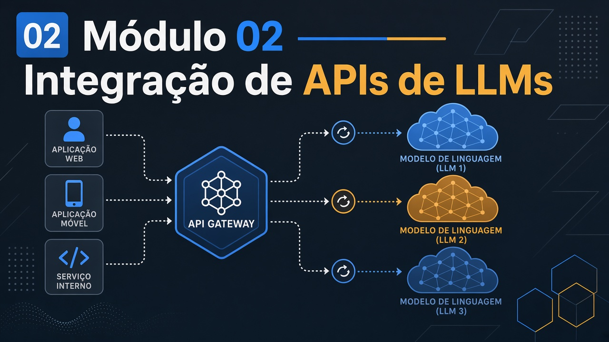

# Módulo 02 — Integração de APIs de LLMs



Pasta: [`modulo02-integracao-apis-llms/`](../../modulo02-integracao-apis-llms/)  
**Não há README do módulo.** Vários READMEs de pasta estão **errados** (falam de gerador de artigos). Siga este guia e o código.  
Carga: ~24 h.  
Anterior: [Módulo 01](./01.md) · Próximo: [Módulo 03](./03.md)

## Por que este módulo existe

No M01 o LLM era um `curl` ou um worker. Em produção você não espalha chaves e modelos pelos controllers: coloca um **contrato estável** (gateway), uma **máquina de estados** (grafo) e **políticas** (quem pode ler o quê). Este módulo ensina a integrar APIs de LLMs como se fossem qualquer outra dependência — com teste, fallback e um lugar só para trocar o modelo.

O caso médico e o Cypher não são “apps de demo aleatórios”: um cobra **saída estruturada + domínio**; o outro cobra **SQL de grafo gerado e corrigido**. Os dois padrões voltam no OpsPilot (M04) e no TrialForge (M08).

```text
Cliente HTTP
    → Gateway (escolhe modelo / provider)
        → Grafo (nós, estado, arestas condicionais)
            → LLM   e/ou   ferramenta de domínio (agenda, Cypher, PDF)
            → memória (Postgres) quando o chat precisa lembrar
            → safeguard ANTES de tool perigosa
```

## Como estudar este capítulo

- Trabalhe em `*-template`. `*-z` é gabarito.
- Se o README da pasta mencionar “Prompt Chaining Article Generator”, **ignore**. O `package.json` do medical ainda pode ter esse nome: o código é agendamento.
- Cada lab responde a uma pergunta de arquitetura (abaixo). Escreva a resposta antes de abrir o `-z`.

## Objetivos de aprendizagem

1. Expor um **gateway** Fastify que escolhe modelo/provider no OpenRouter e validar com E2E.
2. Desenhar um **StateGraph** (nós, arestas condicionais) — inclusive o lab que **não** chama LLM.
3. Completar um grafo de **agendamento médico** no *template* (intent estruturado → serviço → mensagem).
4. Persistir preferências de usuário (Postgres) num chat com memória LangGraph.
5. Demonstrar **prompt injection** bloqueada por safeguard e um caso privilegiado que passa.
6. Gerar e corrigir **Cypher** contra Neo4j com seed de cursos (`plan.md`).

## Conceitos que você precisa internalizar

| Conceito | Por que importa aqui |
| --- | --- |
| **Gateway de modelo** | Isola o restante do sistema da marca do LLM. Trocar Gemma por outro modelo não deveria reescrever o grafo. |
| **Estado** | O que o grafo *lembra* entre nós (intent, slots, histórico). Não é “a conversa inteira no prompt” por acaso. |
| **Aresta condicional** | `if intent == X → nó Y`. É regra; o LLM não precisa decidir o roteamento se você já tem o enum. |
| **Structured output** | JSON com schema. Sem isso, o próximo nó não sabe o que fazer. |
| **Memória de conversa vs perfil** | Histórico da sessão ≠ preferências no Postgres. |
| **Safeguard** | Política **antes** da tool. O modelo não é a camada de autorização. |
| **Text-to-Cypher** | Outro tipo de RAG: o retrieval é uma query de grafo, não um chunk de PDF (M01). |

## Pré-requisitos

- M01: OpenRouter, Docker, noção de RAG/Neo4j (lab 06).
- `OPENROUTER_API_KEY` em todos os labs com LLM. LangSmith opcional.
- Lab 04: Docker Postgres. Lab 06: Docker Neo4j.

## Roteiro de aulas

Trabalhe em `*-template`. `*-z` é gabarito.

### 2.1 — Smart model router (~3 h)

**A ideia.** Um único `POST /chat` na frente de vários modelos. O cliente não conhece OpenRouter. Você valida com teste: modelo inválido, chave ausente, caminho feliz. Isso é o embrião do “modelo é peça trocável” que o M08 formaliza.

[`01-smart-model-router-gateway/`](../../modulo02-integracao-apis-llms/01-smart-model-router-gateway/) — projeto único (sem template).  
`src/server.ts` + `openrouterService.ts`; `POST /chat`; `.env.example`; `npm test`.

**O que observar.** Onde o nome do modelo é escolhido (request vs config vs fallback). Force um modelo inválido e mostre o erro — isso é a evidência do C02.1.

### 2.2 — LangGraph intro (~2 h)

**A ideia.** LangGraph **não** é “GPT com setas”. Este lab classifica `upper`/`lower` **por palavra-chave**, sem LLM, de propósito: para você ver estado, nó e aresta nus. Se você sair daqui achando que todo nó chama modelo, releia o grafo.

[`02-langchain-intro/`](../../modulo02-integracao-apis-llms/02-langchain-intro/)  
`src/graph/`; `langgraph.json`; `npm run langgraph:serve`.

**Pergunta da aula.** O que no código impede este grafo de gastar um token? (Resposta: não há chamada a LLM. Ache o `if`.)

### 2.3 — Consultas médicas (~5 h)

**A ideia.** Agora o grafo tem domínio. Uma frase do paciente vira **intent** (JSON), o intent escolhe um **serviço** (agenda, médico, horário), o último nó monta a mensagem. O LLM entra onde a linguagem é ambígua; a regra entra onde o calendário é determinado.

- Template: [`03-medical-appointment-template/`](../../modulo02-integracao-apis-llms/03-medical-appointment-template/)
- Gabarito: [`03-medical-appointment-z/`](../../modulo02-integracao-apis-llms/03-medical-appointment-z/)

Nós em `src/graph/nodes/`; prompts em `src/prompts/v1/`; `appointmentService`. Ignore o README “article generator”.

**O trabalho no template.** Implemente `identifyIntentNode` (e o que o teste E2E exigir) até ficar verde **com chave real**. Copiar o `-z` sem o template = teto 6,0 neste lab ([avaliacao.md](../avaliacao.md)).

**Armadilha.** `package.json` pode ainda se chamar `prompt-chaining-article-generator`. Não siga esse nome.

### 2.4 — Song highlights + memória (~5 h)

**A ideia.** Chat sem memória recomeça a cada request. Aqui há duas camadas: o fio da conversa (LangGraph) e **preferências** que sobrevivem no Postgres. “Ela gosta de MPB” não deveria viver só no contexto da sessão.

- [`04-song-highlights-template/`](../../modulo02-integracao-apis-llms/04-song-highlights-template/)
- [`04-song-highlights-z/`](../../modulo02-integracao-apis-llms/04-song-highlights-z/)

`docker compose` (Postgres). Scripts `chat:erickwendel` / `chat:ana`.

**O que observar.** Depois de uma sessão, o que ficou no banco? O que só estava no estado do grafo? Essa distinção volta na memória semântica do OpsPilot (M04 U4).

### 2.5 — Safeguard / prompt injection (~4 h)

**A ideia.** Se a tool lê arquivo e a autorização está no prompt (“você é admin”), o usuário **mente** e lê o que quiser. Safeguard é código que roda **antes** da tool, com papéis em `data/users.json`. O caso privilegiado que *passa* também é pedagógico: política ≠ “bloquear tudo”.

- [`05-safeguard-prompt-injection-template/`](../../modulo02-integracao-apis-llms/05-safeguard-prompt-injection-template/)
- [`05-safeguard-prompt-injection-z/`](../../modulo02-integracao-apis-llms/05-safeguard-prompt-injection-z/)

CLI `--user` `--unsafe`. Scripts `chat:member:safe` vs `unsafe:package`. Template **sem** `tests/` (o README mente). O `-z` ainda traz `mcpService.ts`.

**Experimento.** Capture a saída de um membro em modo unsafe (bloqueado) e de um admin (passa). Esses dois logs são o C02.3.

### 2.6 — RAG Neo4j (alunos/cursos) (~4 h)

**A ideia.** No M01 o RAG puxava **texto**. Aqui o LLM gera **Cypher** contra um grafo de cursos/alunos e **corrige** a query quando o banco reclama. É retrieval estruturado. `plan.md` é a spec — o README interno, de novo, pode estar errado.

- Template: [`06-rag-neo4j-students-template/`](../../modulo02-integracao-apis-llms/06-rag-neo4j-students-template/) — siga **[`plan.md`](../../modulo02-integracao-apis-llms/06-rag-neo4j-students-template/plan.md)**
- Gabarito: [`06-rag-neo4j-students-z/`](../../modulo02-integracao-apis-llms/06-rag-neo4j-students-z/)

`npm run docker:infra:*`, `npm run seed`, E2E `tests/sales.e2e.test.ts`.

**O que colar na entrega.** A pergunta em linguagem natural, o Cypher gerado, e se houve loop de correção.

### 2.7 — Doc analysis (~1 h)

**A ideia.** Upload de PDF + Fastify é o caminho curto para “documento entra, modelo extrai”. Não compete com o Cypher: é outro I/O.

[`07-doc-analysis/`](../../modulo02-integracao-apis-llms/07-doc-analysis/) — Fastify **:4000**, upload PDF. **Não há PDF em `docs/` neste clone** e não há pasta `tests/` apesar dos scripts. Use um PDF seu. README só aponta um survey arXiv.

## Atividades práticas

1. No router: force um modelo inválido e mostre o fallback/erro.
2. No template médico: implemente `identifyIntentNode` até o E2E verde (chave real).
3. No safeguard: capture output de `chat:member:safe` vs `unsafe:package`.
4. No Cypher: rode o seed e uma pergunta de ranking de curso; cole o Cypher gerado.

## Erros comuns

- Tratar o lab 2.2 como “quebrado porque não chama GPT”. Ele é a aula.
- Usar o README “article generator” como spec do medical.
- Colocar autorização no system prompt e achar que prompt injection “não rola com modelo bom”.
- Confundir este RAG (Cypher) com o RAG do PDF (M01). Na defesa, diga qual dos dois você rodou.

## Checklist de conclusão

- [ ] C02.1 — router ou intro LangGraph
- [ ] C02.2 — medical no **template**
- [ ] C02.3 — um bloqueio + um admin
- [ ] C02.4 — Cypher **ou** PDF próprio no 07
- [ ] Não usei o README “article generator” como spec
- [ ] Sei desenhar, no papel, um StateGraph com pelo menos uma aresta condicional

## Leituras

**Obrigatórias:** `.env.example` de cada lab que você rodou; `plan.md` do lab 06; código dos nós do grafo que você preencheu.  
**Opcionais:** tracing LangSmith; survey arXiv linkado no README do 07 (só se for o lab 07); links OpenRouter do README raiz.

Não há bibliografia própria neste módulo — gap documentado em [lacunas](../lacunas-e-proximos-passos.md).

## Projeto / desafio do módulo

Entregue **uma** API LangGraph (médico **ou** Cypher) a partir do template: README de 20 linhas (como subir, chave, exemplo `curl`), testes que passam, e um parágrafo do que o `-z` fez diferente da sua solução.

## Ponte para o M03

O grafo já sabe chamar serviços. MCP transforma esses serviços em **contrato padrão** (tools/list, tools/call) para qualquer host — Cursor, Inspector, outro agente. O lab 05 do safeguard até menciona MCP no `-z`: no M03 você *implementa* o servidor.
