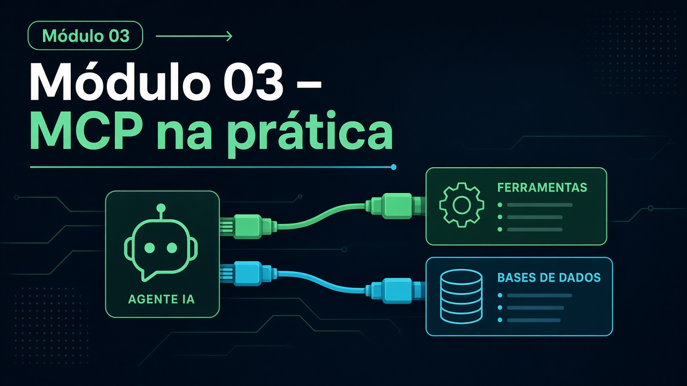

# Módulo 03 — MCP na prática

**Texto da aula:** [`../conteudo/modulo-03/aula.md`](../conteudo/modulo-03/aula.md) (roteiro: [`roteiro-narracao.md`](../conteudo/modulo-03/roteiro-narracao.md)).

Pasta: [`modulo03-mcp-na-pratica/`](../../modulo03-mcp-na-pratica/)  
Sem README de módulo. Vários READMEs de `customers-mcp` repetem o texto do CipherSuite — ignore.  
Carga: ~24 h. Complemento: live [`lives/2026-02-24/`](../../lives/2026-02-24/).

## Objetivos de aprendizagem

1. Ligar um agente LangGraph a **várias** tools MCP (FS, Mongo, CSV) e responder sobre `data/sales.csv`.
2. Expor um servidor MCP **do zero** (resources, prompts, tools) e abri-lo no Inspector.
3. Embrulhar uma **API legado** Fastify+Mongo como MCP (CRUD).
4. Colocar **JWT, RBAC e service token** na API e recusar o MCP sem token.
5. (Desafio) Publicar o pacote MCP num registry **privado** Verdaccio **ou** consumir MCP via LangChain `MultiServerMCPClient`.

## Pré-requisitos

- M01 § MCP (exemplos 06–09) e M02 LangGraph.
- Docker (Mongo, às vezes Verdaccio).
- `OPENROUTER_API_KEY` nos labs com agente. Lab 02: `SERPAPI_API_KEY` (skip permitido).
- Lab 07/09: `SERVICE_TOKEN`.

## Roteiro de aulas

### 3.1 — Múltiplas tools (~4 h)

- [`01-multiple-mcp-tools-template/`](../../modulo03-mcp-na-pratica/01-multiple-mcp-tools-template/) — `getMCPTools()` retorna `[]`
- [`01-multiple-mcp-tools-z/`](../../modulo03-mcp-na-pratica/01-multiple-mcp-tools-z/) — `fsTool`, `mongodbTool`, `reports/`

`docker-compose.yaml` (Mongo + Express). O `package.json` pode falar de SerpAPI: o código é **vendas CSV**.

### 3.2 — Google Trends (~2 h)

[`02-google-trends-agent/`](../../modulo03-mcp-na-pratica/02-google-trends-agent/) — único; tool `google_trends` + SerpAPI; Fastify `/chat`. README errado. Scripts de teste sem pasta `tests/` visível: avalie pelo `/chat`. **Opcional** se não houver chave.

### 3.3 — Instructions de agente (~1 h)

[`03-dev-instructions-agents/`](../../modulo03-mcp-na-pratica/03-dev-instructions-agents/) — `.github/agents/*.agent.md`. Copie para o seu IDE. Sem npm.

### 3.4 — Agent Skills (~1 h)

[`04-skills/`](../../modulo03-mcp-na-pratica/04-skills/) — `.agents/skills/`, `refs.txt`, vídeos de demo. Junto da live 2026-02-24 (`base-teorica/agent-skills-*.md`).

### 3.5 — MCP do zero (~4 h)

- [`05-mcps-do-zero-template/`](../../modulo03-mcp-na-pratica/05-mcps-do-zero-template/) — crypto local, **sem** MCP
- [`05-mcps-do-zero-z/`](../../modulo03-mcp-na-pratica/05-mcps-do-zero-z/) — `src/mcp.ts`, `.vscode/mcp.json`, `npm run mcp:inspect`

README deste lab (CipherSuite AES) **está correto** no `-z`.

### 3.6 — API legado como MCP (~4 h)

[`06-your-legacy-api-as-mcp/`](../../modulo03-mcp-na-pratica/06-your-legacy-api-as-mcp/)

| Subpasta | Papel |
| --- | --- |
| [`nodejs-fastify-mongodb-crud/`](../../modulo03-mcp-na-pratica/06-your-legacy-api-as-mcp/nodejs-fastify-mongodb-crud/) | API `:9999` + Docker Mongo |
| [`customers-mcp-template/`](../../modulo03-mcp-na-pratica/06-your-legacy-api-as-mcp/customers-mcp-template/) | `McpServer` vazio |
| [`customers-mcp-z/`](../../modulo03-mcp-na-pratica/06-your-legacy-api-as-mcp/customers-mcp-z/) | tools CRUD |

Suba a API **antes** do MCP.

### 3.7 — Auth, rate limit, service token (~4 h)

- [`07-api-security-auth-rate-limiting-template/`](../../modulo03-mcp-na-pratica/07-api-security-auth-rate-limiting-template/)
- [`07-api-security-auth-rate-limiting-z/`](../../modulo03-mcp-na-pratica/07-api-security-auth-rate-limiting-z/)

Cada lado tem `nodejs-fastify-mongodb-crud-z/` e `customers-mcp-z/` (o nome `-z` **dentro** do template é armadilha). Compare a **API** template vs API da pasta `07-…-z`: JWT, `requireRole`, `/v1/auth/service-token`. MCP usa `getServiceToken.sh` e `SERVICE_TOKEN`.

### 3.8 — npm privado (~2 h)

[`08-publishing-mcps-private-npm/`](../../modulo03-mcp-na-pratica/08-publishing-mcps-private-npm/) — só gabarito. Verdaccio `:4873` em `customers-mcp-z/docker-compose.yaml`. Scripts `registry:*`, `release:private`.

### 3.9 — MCP + LangChain (~2 h)

[`09-using-mcp-with-langchain/`](../../modulo03-mcp-na-pratica/09-using-mcp-with-langchain/) — `01-multiple-mcp-tools-z` + API. Só `-z`. Precisa de API no ar + `SERVICE_TOKEN` + OpenRouter.

## Atividades práticas

1. No 01: faça o template devolver pelo menos uma tool MCP e responder “top produtos” do CSV.
2. No 05: implemente `list_tools` visível no Inspector.
3. No 06: `create` via MCP e confira no Mongo Express.
4. No 07: uma chamada MCP sem token (falha) e com token (ok).
5. Escolha 08 **ou** 09 para o C03.3.

## Checklist de conclusão

- [ ] C03.1 — Inspector CipherSuite **ou** customers CRUD
- [ ] C03.2 — prova do `SERVICE_TOKEN`
- [ ] C03.3 — Verdaccio **ou** Trends **ou** lab 09
- [ ] Distingo servidor MCP, host (Cursor/Copilot) e Inspector

## Leituras

**Obrigatórias:** [MCP spec/docs](https://modelcontextprotocol.io/) (link no README raiz); [`lives/2026-02-24/base-teorica/mcp-model-context-protocol.md`](../../lives/2026-02-24/base-teorica/mcp-model-context-protocol.md); README real do CipherSuite no lab 05-z; README da API Fastify no lab 06.  
**Opcionais:** Agent Skills (`04-skills/refs.txt`, live skills); publicação npm pública; SerpAPI docs.

## Projeto / desafio do módulo

**Customers MCP autenticado:** API do lab 07 (template evoluído) + MCP que só opera com service token. Entregue: `curl` do token, log do Inspector ou do cliente, e o que acontece se o token expira/ausente.
