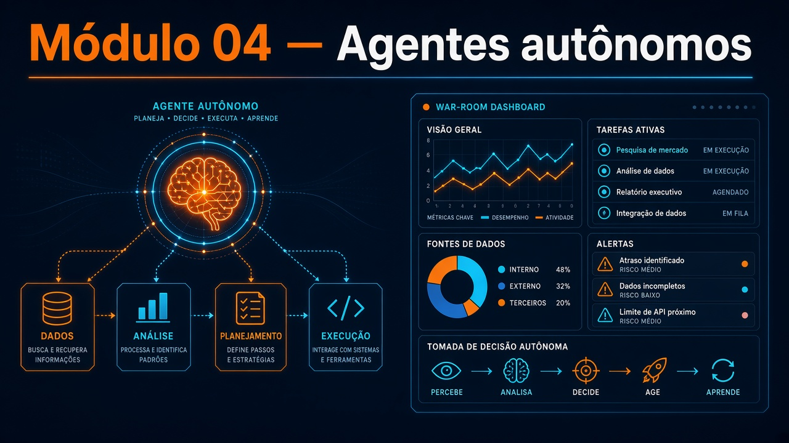

# Módulo 04 — Criação de agentes autônomos

**Texto da aula:** [`../conteudo/modulo-04/aula.md`](../conteudo/modulo-04/aula.md) (roteiro: [`roteiro-narracao.md`](../conteudo/modulo-04/roteiro-narracao.md)).

Pasta: [`modulo04-criacao-de-agentes-autonomos-novo/`](../../modulo04-criacao-de-agentes-autonomos-novo/)  
Leia o [`README.md`](../../modulo04-criacao-de-agentes-autonomos-novo/README.md) **e** o `UNIDADE.md` de cada snapshot.  
A pasta antiga `modulo04-agentes-autonomos/` **não está neste clone**.  
Carga: ~36 h. Live SDD: [`lives/2026-05-27/`](../../lives/2026-05-27/).

Dois produtos: **Notas API** (U1) e **OpsPilot** (U2–U9, snapshots cumulativos).

## Objetivos de aprendizagem

1. Operar um agente de código com SDD (spec → plano → tarefas → implementação) e guardrails de terminal.
2. Comparar **ReAct**, **Plan-and-Execute** e **Reflection** com arena/bench (métrica no store).
3. Expor tools reais (SQLite, status de provider) e o próprio OpsPilot como **servidor MCP**.
4. Persistir conversa + memória semântica e mostrar o refletor no trace.
5. Medir tokens, sumarizar histórico e montar prompt com **orçamento por seção**.
6. Rodar o grafo de produção com roteador e fallback de modelo.
7. Ligar **HITL** (HTTP 202 + `approvalId`) e consultar `/stats` sem vazar conteúdo de PII nos logs.
8. Publicar a war room (API + `web/`) e demonstrar modo **team** (supervisor, blackboard, handoff).

## Pré-requisitos

- M02 (grafo/tools) e M03 (MCP + instructions).
- Node 22, `npm ci`, `OPENROUTER_API_KEY` (modelos `:free` no README do módulo).
- U1: GitHub Copilot ou agente com instructions (`.github/` na Notas API).
- U3+: `npm run mcp`. U4+: download de embeddings Hugging Face na 1ª run. U8+: Vite em `web/`.
- U2–U5: se faltar `.env.example`, copie o de [`06-langgraph-e-workflows-complexos/`](../../modulo04-criacao-de-agentes-autonomos-novo/06-langgraph-e-workflows-complexos/).

Comandos padrão (U2–U9): `npm ci`, `cp .env.example .env`, `npm run dev`, `npm test`, `npm run typecheck`.

## Roteiro de aulas

Cada pasta = estado **ao final** da unidade. Não misture `src/` de U3 com `web/` de U8.

### U1 — Arquitetura de agentes de código (~4 h)

[`01-arquitetura-de-agentes-de-codigo/`](../../modulo04-criacao-de-agentes-autonomos-novo/01-arquitetura-de-agentes-de-codigo/) — [`UNIDADE.md`](../../modulo04-criacao-de-agentes-autonomos-novo/01-arquitetura-de-agentes-de-codigo/UNIDADE.md)  
Projeto: [`notas-api/`](../../modulo04-criacao-de-agentes-autonomos-novo/01-arquitetura-de-agentes-de-codigo/notas-api/). Specs em `specs/`. Fluxo `/especificar` → `/planejar` → `/tarefas` → `/implementar`.

### U2 — Padrões de raciocínio (~4 h)

[`02-padroes-de-raciocinio-e-execucao/`](../../modulo04-criacao-de-agentes-autonomos-novo/02-padroes-de-raciocinio-e-execucao/)  
OpsPilot (Mercadinho). Specs 001–002. `npm run arena -- --strategies react,plan-execute` e `npm run bench`.  
`src/strategies/{react,plan-execute,reflect}.ts`.

### U3 — Function calling e tools (~4 h)

[`03-function-calling-e-tool-use/`](../../modulo04-criacao-de-agentes-autonomos-novo/03-function-calling-e-tool-use/)  
Specs 003–006 (+ 007 já no commit). `POST /chat`, SQLite, `npm run mcp`.

### U4 — Memória e reflexão (~4 h)

[`04-memoria-e-reflexao-em-agentes-autonomos/`](../../modulo04-criacao-de-agentes-autonomos-novo/04-memoria-e-reflexao-em-agentes-autonomos/)  
007–009. `/chat` com `conversationId`/`userId`; `POST /memories`; evento `learning`.

### U5 — Contextos (~4 h)

[`05-gerenciamento-de-contextos/`](../../modulo04-criacao-de-agentes-autonomos-novo/05-gerenciamento-de-contextos/)  
010–012. `./scripts/conversa-longa.sh` (30 turnos). Eventos `context` e `summarize`.

### U6 — LangGraph de produção (~4 h)

[`06-langgraph-e-workflows-complexos/`](../../modulo04-criacao-de-agentes-autonomos-novo/06-langgraph-e-workflows-complexos/)  
013–014. `/chat` **sem** `strategy` → `route` / `routeReason`. Sem `web/` ainda.

### U7 — Observabilidade e autonomia (~4 h)

[`07-observabilidade-e-limites-de-autonomia/`](../../modulo04-criacao-de-agentes-autonomos-novo/07-observabilidade-e-limites-de-autonomia/)  
015. `awaitHumanApproval: true` → 202; `GET /requests/:id`; `GET /stats`.

### U8 — War room publicado (~4 h)

[`08-projeto-pratico-opspilot-publicado/`](../../modulo04-criacao-de-agentes-autonomos-novo/08-projeto-pratico-opspilot-publicado/)  
016–017. API `:3000` + `web/` `:5173`. README da pasta com Pages. `.github/workflows/deploy.yml`.

### U9 — Multiagente (~4 h)

[`09-multi-agent-systems/`](../../modulo04-criacao-de-agentes-autonomos-novo/09-multi-agent-systems/)  
018 `src/team/`. Pedidos que exigem análise+plano+ação → rota `team`, eventos `handoff`.

Os `UNIDADE.md` listam o que o roteiro planejou e **não** entrou no snapshot — não cobre na demo.

## Atividades práticas

1. U1: uma feature nova na Notas API só via spec (não edite `src/` na mão primeiro).
2. U2: tabela arena ReAct vs Plan-and-Execute (acertos).
3. U3: uma tool sua (mesmo stub) registrada e chamada no trace.
4. U5 **ou** U7: evidência de sumarização **ou** aprovação humana.
5. U8 ou U9: print da war room (raciocínio visível ou handoff).

## Checklist de conclusão

- [ ] C04.1 — SDD na Notas API
- [ ] C04.2 — arena/bench
- [ ] C04.3 — `/chat` + tool
- [ ] C04.4 — conversa longa **ou** HITL
- [ ] C04.5 — war room **ou** team
- [ ] Li o `UNIDADE.md` do snapshot que entreguei

## Leituras

**Obrigatórias:** README do módulo; cada `UNIDADE.md` usada; paper ReAct `https://arxiv.org/abs/2210.03629` (README raiz M08, vale aqui); OpenRouter `:free`.  
**Opcionais:** desvios listados no `UNIDADE.md`; live SDD 2026-05-27; MCP docs; LangGraph docs (não inventar URL extra — use as do README raiz quando existirem).

## Projeto / desafio do módulo

OpsPilot no snapshot **U8 ou U9**: incidente fictício do Mercadinho, trace exportado ou print da war room, e um parágrafo: o que **não** deveria ser autônomo (ligue ao HITL da U7).
