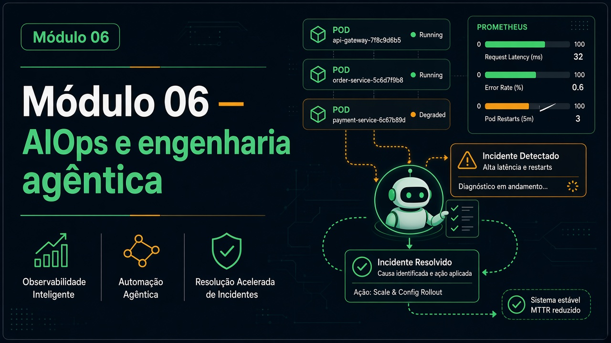

# Módulo 06 — AIOps e engenharia agêntica (Nexus)



Pasta: [`modulo06-aiops-engenharia-agentica/`](../../modulo06-aiops-engenharia-agentica/)  
README operacional: [`README.md`](../../modulo06-aiops-engenharia-agentica/README.md).  
Carga: ~28 h (12 labs). Teoria extra em [`slides/`](../../modulo06-aiops-engenharia-agentica/slides/).

## Objetivos de aprendizagem

1. Subir o ambiente Python/CrewAI e disparar labs pelo menu `nexus_iac_copilot.py`.
2. Gerar IaC (Terraform) e manifesto K8s **com auditoria** de conformidade.
3. Diagnosticar incidente estilo CrashLoop com loop **ReAct** (Prometheus/Jaeger **simulados**).
4. Traduzir NL→PromQL e produzir alerta preditivo + JSON de dashboard.
5. Operar ChatOps com **HITL** (senha `GESTOR-APROVA`) e guardrail dry-run (`sim`/`nao`).
6. Triar CVE (Trivy JSON), otimizar workflow Actions, caçar zumbis FinOps, remediár via **RAG de runbook**.
7. Coordenar incidente **multidomínio** no lab 12 (Nexus Manager hierárquico) e emitir relatório executivo.

## Pré-requisitos

- Python 3.10–3.13 (**não** 3.14). Docker, `kubectl`.
- `GROQ_API_KEY` (veja `core/llm_config.py`; README não cria `.env` — exporte a variável).
- Conceito ReAct (M04 U2 ou paper). Cluster local só para labs 4/11 (manifests em `k8s/`).
- `pip install -r requirements.txt` e `pip install streamlit` no venv.

```bash
cd modulo06-aiops-engenharia-agentica
python3 -m venv venv
source venv/bin/activate   # Windows: venv\Scripts\activate
pip install -r requirements.txt
pip install streamlit
export GROQ_API_KEY=...
python3 nexus_iac_copilot.py
```

Dashboard opcional: `streamlit run ui/app.py` (LocalStack :4566 se for usar S3 explorer).

## Roteiro de aulas

Ordem **1→12**. ~2 h cada; lab 12 ~4 h.

| Lab | Arquivo | O aluno faz |
| --- | --- | --- |
| 1 Fundação | [`labs/modulo1_foundation.py`](../../modulo06-aiops-engenharia-agentica/labs/modulo1_foundation.py) | S3 de logs + `check_compliance_rules` |
| 2 IaC Copilot | [`labs/modulo2_iac_copilot.py`](../../modulo06-aiops-engenharia-agentica/labs/modulo2_iac_copilot.py) | Gerar/auditar `main.tf` |
| 3 K8s GitOps | [`labs/modulo3_k8s_ops.py`](../../modulo06-aiops-engenharia-agentica/labs/modulo3_k8s_ops.py) | Manifesto + Canary |
| 4 ReAct | [`labs/modulo4_troubleshooting.py`](../../modulo06-aiops-engenharia-agentica/labs/modulo4_troubleshooting.py) | `kubectl apply -f k8s/deploy.yml` depois o lab |
| 5 Preditivo | [`labs/modulo5_aiops.py`](../../modulo06-aiops-engenharia-agentica/labs/modulo5_aiops.py) | PromQL + Grafana JSON |
| 6 ChatOps | [`labs/modulo6_chatops.py`](../../modulo06-aiops-engenharia-agentica/labs/modulo6_chatops.py) | `streamlit run labs/modulo6_chatops.py` |
| 7 DevSecOps | [`labs/modulo7_devsecops.py`](../../modulo06-aiops-engenharia-agentica/labs/modulo7_devsecops.py) | [`data/trivy.json`](../../modulo06-aiops-engenharia-agentica/data/trivy.json) |
| 8 CI/CD | [`labs/modulo8_cicd.py`](../../modulo06-aiops-engenharia-agentica/labs/modulo8_cicd.py) | [`data/workflow_lento.yaml`](../../modulo06-aiops-engenharia-agentica/data/workflow_lento.yaml) |
| 9 FinOps | [`labs/modulo9_finops.py`](../../modulo06-aiops-engenharia-agentica/labs/modulo9_finops.py) | [`data/inventario_cloud.json`](../../modulo06-aiops-engenharia-agentica/data/inventario_cloud.json) |
| 10 RAG | [`labs/modulo10_remediation.py`](../../modulo06-aiops-engenharia-agentica/labs/modulo10_remediation.py) | [`data/runbook_db.md`](../../modulo06-aiops-engenharia-agentica/data/runbook_db.md) |
| 11 Guardrails | [`labs/modulo11_guardrails.py`](../../modulo06-aiops-engenharia-agentica/labs/modulo11_guardrails.py) | Dry-run + aprovação |
| 12 Final | [`labs/modulo12_projeto_final.py`](../../modulo06-aiops-engenharia-agentica/labs/modulo12_projeto_final.py) | Checkout 500 + XZ + custo +40% |

Leitura de código (não é lab separado): [`core/agents.py`](../../modulo06-aiops-engenharia-agentica/core/agents.py), [`tools/`](../../modulo06-aiops-engenharia-agentica/tools/), [`k8s/`](../../modulo06-aiops-engenharia-agentica/k8s/).

Ollama no cluster (`k8s/ollama.yaml`, slides 135) é **complementar**, não pré-requisito do README.

## Atividades práticas

1. Labs 1–2 até existir `main.tf` auditável.
2. Lab 4 com o pod quebrado aplicado.
3. Lab 6: tente destruir o banco e registre o desafio da senha.
4. Um de {7, 9, 10} com o JSON/Markdown de saída.
5. Labs 11 + 12: cole o relatório executivo.

## Checklist de conclusão

- [ ] C06.1 — labs 1–2
- [ ] C06.2 — lab 4 **ou** 6
- [ ] C06.3 — 7 ou 9 ou 10
- [ ] C06.4 — 11 e 12
- [ ] venv ativo (sem `ModuleNotFoundError: crewai`)

## Leituras

**Obrigatórias:** README do módulo (seções de cada lab); paper ReAct se não fez M04.  
**Opcionais:** `slides/slides1.md`–`slides12.md`; CrewAI, Groq, Prometheus, Jaeger, Grafana, Trivy, OPA, Terraform, LocalStack, GitHub Actions — links no [README da raiz](../../README.md) Módulo 06. CVE XZ no README raiz.

## Projeto / desafio do módulo

**Game day Nexus:** rode o lab 12 e entregue o relatório (SRE + Segurança + FinOps) + 15 linhas: o que você **não** deixaria o Manager aplicar sozinho em produção (amarre ao lab 11).
