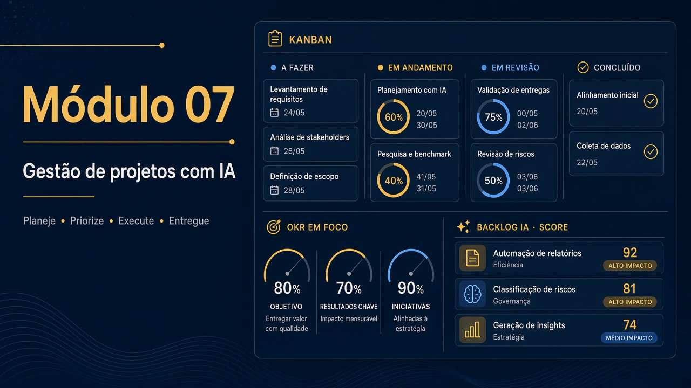

# Módulo 07 — Ferramentas de IA para gestão de projetos (RouteWise)



Pasta: [`modulo07-ferramentas-de-ia-para-gestao-de-projetos/`](../../modulo07-ferramentas-de-ia-para-gestao-de-projetos/)  
README: [`README.md`](../../modulo07-ferramentas-de-ia-para-gestao-de-projetos/README.md).  
Professor no README: Dr. José Ahirton Batista Lopes Filho. Carga: ~20 h.  
Anterior: [Módulo 06](./06.md) · Próximo: [Módulo 08](./08.md)

Caso único: **RouteWise** (Conecta Cargas, 140 veículos). Cada pasta tem `Atividade - Módulo N.pdf` (missão) e `Exemplo - Módulo N.pdf` (gabarito). Entregue a Atividade **ou** o checkpoint de [avaliacao.md](../avaliacao.md) — uma nota só.

## Por que este módulo existe

Gestão com IA falha de dois jeitos: o time **abdica** do critério (cola o output-exemplo) ou **ignora** a ferramenta (faz a planilha no feeling). RouteWise treina o meio: a IA extrai e redige; **RICE, WSJF, Monte Carlo e Danger** não são o LLM. O board evolui pasta a pasta — leia `jira-estado-board.md` quando existir (01–07 e 10; **não** em 08 nem 09).

```text
Transcrição de discovery
    → backlog INVEST + Gherkin
        → RICE / WSJF (flags que você discorda)
            → cronograma + PERT
                → Monte Carlo em SCRIPT (P50/P85/P95)
                    → risco, digest, status (três audiências)
                        → compliance + Danger no PR
                            → NL → card Jira
                                → OKRs + scorecard de portfólio
```

## Como estudar este capítulo

Fluxo do README do módulo: vídeo → `*-prompt.md` no System Instructions → dados da pasta → comparar `output-exemplo-*`.  
Cada pasta ~2 h. Jira Cloud é opcional (há CSV de import no M1). Slack/Make.com só no M9 (há bot Node).

Clone com `--recurse-submodules` se for usar a demo CI (`routewise-danger-demo` em `.gitmodules`).

## Objetivos de aprendizagem

1. Extrair backlog INVEST + Gherkin de uma **transcrição** (Requirements Copilot).
2. Priorizar com **RICE e WSJF** e justificar flags (Backlog Scorer).
3. Montar cronograma com capacidade e what-if (Scheduling).
4. Estimar com PERT e rodar **Monte Carlo em script** (não no LLM).
5. Detectar anomalia de fluxo (Risk Monitor) e gerar digest/status para audiências distintas.
6. Gerar checklist de compliance e falhar um PR com **Danger**.
7. Parsear NL→card Jira (Make.com ou bot Node) e validar OKRs + scorecard de portfólio.

## Conceitos que você precisa internalizar

| Ferramenta | O que a IA faz | O que você não terceiriza |
| --- | --- | --- |
| Requirements Copilot | Tira história da transcrição | INVEST verdadeiro / critério de pronto |
| RICE / WSJF | Calcula e sinaliza | Discordar de Reach inflado |
| Scheduling | Encaixa capacidade | What-if irreal (“todo mundo 100%”) |
| PERT + Monte Carlo | Três pontos; o **script** simula | Pedir P85 ao Gemini |
| Risk Monitor | Anomalia no CSV de fluxo | Decisão de parar a sprint |
| Digest / Status | Mesmo board, tons diferentes | Mentir para o patrocinador |
| Danger | Checklist vira regra de PR | Merge com evidência vermelha |
| OKR Aligner | Cruza objetivo × backlog | OKR vaidade |

## Pré-requisitos

- M01 prompts. Google AI Studio. Node e/ou Python para M4 e M8.

## Roteiro de aulas

### 7.1 Requirements Copilot

**A ideia.** Transcrição não é backlog. O copilot propõe épicos/histórias/Gherkin; você corta o que a reunião não decidiu. Sem isso, o scorer da 7.2 prioriza ficção.

[`modulo-01-planejamento-e-escopo/`](../../modulo07-ferramentas-de-ia-para-gestao-de-projetos/modulo-01-planejamento-e-escopo/)  
`requirements-copilot-system-prompt.md`, `transcricao-discovery-routewise.md`, `routewise-jira-import.csv`, `guia-board-routewise.md`. Missão: [`Atividade - Módulo 1.pdf`](../../modulo07-ferramentas-de-ia-para-gestao-de-projetos/modulo-01-planejamento-e-escopo/Atividade%20-%20Módulo%201.pdf) · gabarito [`Exemplo - Módulo 1.pdf`](../../modulo07-ferramentas-de-ia-para-gestao-de-projetos/modulo-01-planejamento-e-escopo/Exemplo%20-%20Módulo%201.pdf).

**Trabalho.** Diff com `output-demo-m1.2-v1.0.md`: três itens que você não aceitaria no Jira.

### 7.2 Backlog Scorer

**A ideia.** RICE e WSJF **quantificam** opinião. Flags existem para você discutar, não para obedecer. Reach “todo o Brasil” sem evidência é o anti-padrão da aula.

[`modulo-02-priorizacao-de-backlog/`](../../modulo07-ferramentas-de-ia-para-gestao-de-projetos/modulo-02-priorizacao-de-backlog/)  
`backlog-scorer-prompt.md`, `backlog-routewise-input.md`.

### 7.3 Scheduling

**A ideia.** Capacidade finita. What-if (“e se a integração atrasar 2 sprints?”) é o exercício, não o Gantt bonito.

[`modulo-03-cronograma-e-capacidade/`](../../modulo07-ferramentas-de-ia-para-gestao-de-projetos/modulo-03-cronograma-e-capacidade/)  
`scheduling-prompt.md`, `scheduling-routewise-input.md`.

### 7.4 Probability Forecast

**A ideia.** Planning fallacy: humanos subestimam. PERT dá três pontos; **Monte Carlo** (`monte-carlo-routewise.js` / `.py`) empilha incerteza. O LLM pode narrar o resultado; **não** gera o P50. Compare o chute do modelo com o script.

[`modulo-04-estimativas-e-previsoes/`](../../modulo07-ferramentas-de-ia-para-gestao-de-projetos/modulo-04-estimativas-e-previsoes/)

### 7.5 Risk Monitor

**A ideia.** AIOps de projeto: WIP, aging, vazão no CSV. Não é o Nexus (cluster). Anomalia ≠ incidente de pod; é “essa coluna não anda”.

[`modulo-05-riscos-e-aiops/`](../../modulo07-ferramentas-de-ia-para-gestao-de-projetos/modulo-05-riscos-e-aiops/)  
`risk-monitor-prompt.md`, `risk-monitor-data-exemplo.csv`.

### 7.6 Meeting Digest

**A ideia.** Sprint review transcrita vira digest acionável. O risco é o modelo **inventar** um acordo. Marque no output o que não está na transcrição.

[`modulo-06-reunioes-turbinadas/`](../../modulo07-ferramentas-de-ia-para-gestao-de-projetos/modulo-06-reunioes-turbinadas/)  
`meeting-digest-prompt.md`, `transcricao-sprint-review-s2.md`.

### 7.7 Status Report

**A ideia.** Três audiências, o mesmo board. Diretoria ≠ time ≠ cliente. Se os três textos forem iguais, o prompt falhou (ou você não leu).

[`modulo-07-status-reports/`](../../modulo07-ferramentas-de-ia-para-gestao-de-projetos/modulo-07-status-reports/)  
`status-report-prompt.md`.

### 7.8 Compliance + Danger

**A ideia.** Checklist de compliance que só vive em Markdown não bloqueia merge. Danger executa a regra no PR. `danger-config-routewise.py --local` nos dois mocks: um passa, um falha. Sem `jira-estado-board.md` nesta pasta.

[`modulo-08-governanca-e-compliance/`](../../modulo07-ferramentas-de-ia-para-gestao-de-projetos/modulo-08-governanca-e-compliance/)  
`guia-demo-danger.md`, `pr-mock-routewise.json`, `pr-mock-falhas.json`. Submódulo git para a demo CI.

### 7.9 NL to Workflow

**A ideia.** “Cria um card no Jira para…” vira payload. Make.com **ou** `ecosystem-bot-template.js`. Sem board nesta pasta. Não é obrigatório ter Slack pago.

[`modulo-09-automacao-de-ecossistema/`](../../modulo07-ferramentas-de-ia-para-gestao-de-projetos/modulo-09-automacao-de-ecossistema/)  
`setup-guide-m9.md`, `nl-to-workflow-prompt.md`, `make-blueprint-m9.json`.

### 7.10 OKR Aligner

**A ideia.** Parte A valida OKRs; B cruza backlog×objetivo; C monta scorecard (RouteWise + Fintech + E-commerce). Portfólio sem OKR mensurável é slide.

[`modulo-10-portfolio-e-okrs/`](../../modulo07-ferramentas-de-ia-para-gestao-de-projetos/modulo-10-portfolio-e-okrs/)  
`okr-aligner-prompt.md`.

## Atividades práticas

1. M1: gere o backlog da transcrição; diff com `output-demo-m1.2-v1.0.md`.
2. M2: rode o scorer; liste 3 flags que você discorda.
3. M4: execute o script Monte Carlo e compare P50 com o chute do LLM.
4. M8: `danger-config-routewise.py --local` nos dois mocks.
5. M10: preencha as três partes (RouteWise ou seu projeto).

## Erros comuns

- Somar nota da Atividade PDF **e** do checkpoint. É uma só ([avaliacao.md](../avaliacao.md)).
- Pedir ao AI Studio “rode o Monte Carlo”. O arquivo `.js`/`.py` é a aula.
- Copiar `output-exemplo-*` sem marcar discordâncias. Rubrica de curadoria zera.
- Procurar `jira-estado-board.md` em 08/09 e achar o módulo incompleto.

## Checklist de conclusão

- [ ] C07.1 — backlog da transcrição
- [ ] C07.2 — scorer **ou** Monte Carlo script
- [ ] C07.3 — Danger: um PR que falha e um que passa
- [ ] C07.4 — OKR Aligner
- [ ] Curadoria explícita vs `output-exemplo-*`
- [ ] Em cada unidade entregue, a missão foi a **Atividade PDF ou** o checkpoint — não os dois
- [ ] Anotei um número (P50/P85 ou score RICE) que **não** veio do LLM

## Leituras

**Obrigatórias:** README do módulo; o `*-prompt.md` de cada ferramenta que você entregar.  
**Opcionais (já no README raiz):** [RICE](https://www.intercom.com/blog/rice-simple-prioritization-for-product-managers/), [WSJF](https://framework.scaledagile.com/wsjf), [MoSCoW](https://www.agilebusiness.org/dsdm-project-framework/moscow-prioritisation.html), PERT e Planning Fallacy (Wikipedia no README), [IBM Cost of a Data Breach 2025](https://www.ibm.com/reports/data-breach).

## Projeto / desafio do módulo

**Dossiê RouteWise (ou caso próprio no mesmo pipeline):** transcrição→backlog→prioridade→um número de Monte Carlo→OKRs. Uma página: onde a IA alucinou e o que você cortou.

## Ponte para o M08

Você já recusou output de LLM com critério. O M08 pede o mesmo para **arquitetura**: agente vs regra, gate de aprovação, canvas com caso próprio — não “o TrialForge pronto no PDF”.
