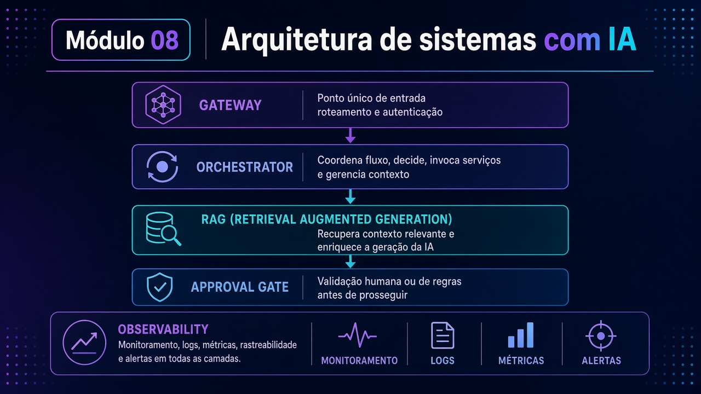

# Módulo 08 — Arquitetura de sistemas com IA (TrialForge)

**Texto da aula:** [`../conteudo/modulo-08/aula.md`](../conteudo/modulo-08/aula.md) (roteiro: [`roteiro-narracao.md`](../conteudo/modulo-08/roteiro-narracao.md)).

Pasta: [`modulo08-arquitetura-de-sistemas-com-ia/`](../../modulo08-arquitetura-de-sistemas-com-ia/)  
README: [`README.md`](../../modulo08-arquitetura-de-sistemas-com-ia/README.md).  
Carga: ~20 h. Caso de referência: **TrialForge** / Vitalis Pharma (ICF, Protocolo, CSR). Canvases devem ser preenchidos com **caso próprio**.

## Objetivos de aprendizagem

1. Desenhar o diagrama **Gateway → Orquestrador → Modelo+RAG → Approval Gate** + observabilidade.
2. Decidir **agente vs regra** com o `decision-framework-tool` (não no feeling).
3. Explicar o loop ReAct e rodar o protótipo single-agent (Ollama ou pagos).
4. Escolher um dos **6 padrões** multiagente e justificar falha distribuída (CAP/Saga) no canvas.
5. Montar gateway com RAG avançado, roteamento, cache e HITL; comparar `audit-trail.jsonl`.
6. Descrever stack enterprise (tiering, eval gate, guardrail) e executar o protótipo de tiering.

## Pré-requisitos

- M04 (agente, HITL) e M01 RAG; MCP conceitual (M03).
- Ollama + `ollama pull gemma4:e2b` (~7 GB) **antes** da semana. M4.5/M5.4: `nomic-embed-text` e `gemma4` (maior).
- Node (`npm install` nas pastas com `package.json`: M2, M4, M5) **ou** Python (paridade).
- Alternativa: `provedores-pagos.js/.py` (chaves Claude/Gemini/GPT).

## Roteiro de aulas

Fluxo do README: vídeo → canvas → `node` ou `python` → `audit-trail*.jsonl` → missão `Atividade N - Módulo N.pdf` **ou** checkpoint ([avaliacao.md](../avaliacao.md)); `Exemplo - Módulo N.pdf` é gabarito.

### 8.1 — Fundamentos AI-first (~4 h)

[`modulo-01-fundamentos-ai-first/`](../../modulo08-arquitetura-de-sistemas-com-ia/modulo-01-fundamentos-ai-first/)  
`reference-architecture-canvas.md`, `ai-first-architecture-canvas.md`, `decision-framework-checklist.md`, `decision-framework-tool.js` / `decision_framework_tool.py`. [`cheat-sheet-arquiteturas-referencia-clouds.pdf`](../../modulo08-arquitetura-de-sistemas-com-ia/modulo-01-fundamentos-ai-first/cheat-sheet-arquiteturas-referencia-clouds.pdf), canvases [`AI-Architecture-Decision-Canvas.pdf`](../../modulo08-arquitetura-de-sistemas-com-ia/modulo-01-fundamentos-ai-first/AI-Architecture-Decision-Canvas.pdf) / [`…-Preenchido-TrialForge.pdf`](../../modulo08-arquitetura-de-sistemas-com-ia/modulo-01-fundamentos-ai-first/AI-Architecture-Decision-Canvas-Preenchido-TrialForge.pdf). Missão: [`Atividade 1 - Módulo 1.pdf`](../../modulo08-arquitetura-de-sistemas-com-ia/modulo-01-fundamentos-ai-first/Atividade%201%20-%20Módulo%201.pdf) · gabarito [`Exemplo - Módulo 1.pdf`](../../modulo08-arquitetura-de-sistemas-com-ia/modulo-01-fundamentos-ai-first/Exemplo%20-%20Módulo%201.pdf).

### 8.2 — Single-agent (~4 h)

[`modulo-02-single-agent/`](../../modulo08-arquitetura-de-sistemas-com-ia/modulo-02-single-agent/)  
Canvases: anatomia, ReAct, reflexão, tool schema, blueprint. Protótipos `react-agent-prototype.js` / `react_agent_prototype.py`, `agent-components-demo.js` / `agent_components_demo.py`. Missão: [`Atividade 2 - Módulo 2.pdf`](../../modulo08-arquitetura-de-sistemas-com-ia/modulo-02-single-agent/Atividade%202%20-%20Módulo%202.pdf) · gabarito [`Exemplo - Módulo 2.pdf`](../../modulo08-arquitetura-de-sistemas-com-ia/modulo-02-single-agent/Exemplo%20-%20Módulo%202.pdf).

### 8.3 — Multi-agent (~4 h)

[`modulo-03-multi-agent/`](../../modulo08-arquitetura-de-sistemas-com-ia/modulo-03-multi-agent/)  
`orchestration-pattern-selector.md` e `-v2.md` (Sequential, Parallel, Supervisor, Hierarchical, Group Chat, Handoff). `trialforge-message-queue-prototype.js` / `trialforge_message_queue_prototype.py`. `distributed-failure-canvas.md`. Missão: [`Atividade 3 - Módulo 3.pdf`](../../modulo08-arquitetura-de-sistemas-com-ia/modulo-03-multi-agent/Atividade%203%20-%20Módulo%203.pdf) · gabarito [`Exemplo - Módulo 3.pdf`](../../modulo08-arquitetura-de-sistemas-com-ia/modulo-03-multi-agent/Exemplo%20-%20Módulo%203.pdf).

### 8.4 — Padrões AI-específicos (~4 h)

[`modulo-04-padroes-ai-especificos/`](../../modulo08-arquitetura-de-sistemas-com-ia/modulo-04-padroes-ai-especificos/)  
RAG selector, routing, cache/streaming, HITL, `gateway-blueprint-canvas.md`. `trialforge-gateway-prototype.js` / `trialforge_gateway_prototype.py`, `audit-trail.jsonl`. **Não copie limiares do demo** — o canvas pede medição. Missão: [`Atividade 4 - Módulo 4.pdf`](../../modulo08-arquitetura-de-sistemas-com-ia/modulo-04-padroes-ai-especificos/Atividade%204%20-%20Módulo%204.pdf) · gabarito [`Exemplo - Módulo 4.pdf`](../../modulo08-arquitetura-de-sistemas-com-ia/modulo-04-padroes-ai-especificos/Exemplo%20-%20Módulo%204.pdf).

### 8.5 — Enterprise (~4 h)

[`modulo-05-arquitetura-enterprise/`](../../modulo08-arquitetura-de-sistemas-com-ia/modulo-05-arquitetura-enterprise/)  
Canvases de stack, sinais de obs, deploy, cascade. Protótipos: `trialforge-model-tiering-prototype.js` / `trialforge_model_tiering_prototype.py`, `model-eval-gate-prototype.js` / `model_eval_gate_prototype.py`, `manipulation-guardrail-prototype.js` / `manipulation_guardrail_prototype.py`. `audit-trail-tiering.jsonl`. Missão: [`Atividade 5 - Módulo 5.pdf`](../../modulo08-arquitetura-de-sistemas-com-ia/modulo-05-arquitetura-enterprise/Atividade%205%20-%20Módulo%205.pdf) · gabarito [`Exemplo - Módulo 5.pdf`](../../modulo08-arquitetura-de-sistemas-com-ia/modulo-05-arquitetura-enterprise/Exemplo%20-%20Módulo%205.pdf).

## Atividades práticas

1. Preencha o canvas M1 com **seu** sistema (não cole TrialForge).
2. Rode o ReAct prototype; cole um trace de 1 loop.
3. No seletor M3, marque um padrão e o modo de falha.
4. Rode gateway **ou** tiering e diff vs `audit-trail*.jsonl`.

## Checklist de conclusão

- [ ] C08.1 — canvas M1 caso próprio
- [ ] C08.2 — ReAct rodando
- [ ] C08.3 — padrão M3 justificado
- [ ] C08.4 — gateway ou tiering + audit trail
- [ ] Trade-off local vs pago (tabela do README do módulo) citado na entrega
- [ ] Missão da unidade: **Atividade PDF ou** checkpoint — não os dois

## Leituras

**Obrigatórias:** README do módulo; canvases das aulas que você entregar; ReAct `https://arxiv.org/abs/2210.03629`; RAG `https://arxiv.org/abs/2005.11401`; [MCP](https://modelcontextprotocol.io/).  
**Opcionais (README raiz M08):** [CAP](https://en.wikipedia.org/wiki/CAP_theorem); [A2A](https://a2a-protocol.org/); [RAND Why AI Projects Fail](https://www.rand.org/pubs/research_reports/RRA2680-1.html).

## Projeto / desafio do módulo

**ADRs curtos (3–5) + um protótipo M4 ou M5:** para o seu caso, defina Approval Gate (quem aprova o quê) e um eval gate (o que impede promover modelo). TrialForge só como referência.
