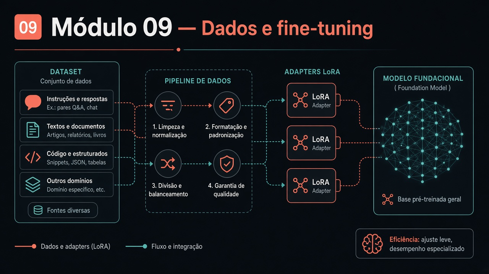

# Módulo 09 — Processamento de dados e fine-tuning (Amplitude Seguros)

**Texto da aula:** [`../conteudo/modulo-09/aula.md`](../conteudo/modulo-09/aula.md) (roteiro: [`roteiro-narracao.md`](../conteudo/modulo-09/roteiro-narracao.md)).

Pasta: [`modulo09-processamento-de-dados-e-fine-tuning-de-modelos/`](../../modulo09-processamento-de-dados-e-fine-tuning-de-modelos/)  
README (custo, env, paridade JS/Python): [`README.md`](../../modulo09-processamento-de-dados-e-fine-tuning-de-modelos/README.md).  
Carga: ~28 h. Caso: **Amplitude Seguros** (Auto + Saúde Empresarial).

Há caminho **sem Vertex**: M1–M2 + LoRA MLX/Colab (M4) + harness local (M5.4) + capstone `--local` (M6.2). Documente a escolha.

Missão de cada unidade: `Atividade N - Módulo N.pdf` na pasta **ou** o checkpoint em [avaliacao.md](../avaliacao.md) — uma nota só. O `Exemplo - Módulo N.pdf` é gabarito.

## Objetivos de aprendizagem

1. Aplicar o framework de **4 perguntas + AHP + NPV** e reprovar pelo menos um caso (Atendimento no JSON).
2. Montar JSONL (schema, dedup MinHash+LSH, balanceamento, PII) e contrastar OCR vs LLM multimodal.
3. Disparar **ou** descrever com evidência um job de fine-tuning via API (Vertex) com versionamento.
4. Treinar **LoRA** (rank 4/8/16) no MLX **ou** no Colab T4 — pesos **não** vêm no Git.
5. Rodar o harness (A/B, estresse de formato, NPV real vs projetado) e emitir veredito de escala.
6. Entregar capstone: assistente + dataset 3k (ou reavaliação honesta) + `decisoes-de-arquitetura.md` próprio.

## Pré-requisitos

- M01 embeddings. Node e/ou Python 3 (stdlib na maioria das tools).
- Vertex: `gcp-setup-companion.md` no M3; vars `GCP_PROJECT_ID`, `TUNING_JOB_NAME`, `ENDPOINT_MODULO32`, `ENDPOINT_MODULO63`. Billing real (ordem de grandeza no README: jobs entre R$0,86 e R$41,40 na gravação).
- Sem Mac: notebooks `colab-*-companion.md` nos M4, M5, M6.
- Antes de rodar API: [`risco-validade-modelo-companion.md`](../../modulo09-processamento-de-dados-e-fine-tuning-de-modelos/risco-validade-modelo-companion.md).

Companions de disciplina (leia cedo):

- [`casos-de-mercado-fine-tuning-companion.md`](../../modulo09-processamento-de-dados-e-fine-tuning-de-modelos/casos-de-mercado-fine-tuning-companion.md)
- [`disponibilidade-fine-tuning-provedores-companion.md`](../../modulo09-processamento-de-dados-e-fine-tuning-de-modelos/disponibilidade-fine-tuning-provedores-companion.md)
- [`historico-fine-tuning-companion.md`](../../modulo09-processamento-de-dados-e-fine-tuning-de-modelos/historico-fine-tuning-companion.md)

## Roteiro de aulas

Tools: `node arquivo.js` ou `python3 arquivo.py`. Imports cruzam pastas — rode a partir do layout do repo.

### 9.1 — Decision framework (~4 h)

[`modulo-01-decision-framework/`](../../modulo09-processamento-de-dados-e-fine-tuning-de-modelos/modulo-01-decision-framework/)  
`decision-framework-tool.js` / `decision_framework_tool.py`, `grpo-verifiable-reward-demo.js` / `grpo_verifiable_reward_demo.py`, `amplitude-seguros-casos.json`, `fine-tuning-types-cheatsheet.md`, `fine-tuning-zoo-poster.html`, `decision-framework-checklist.md`. Missão: [`Atividade 1 - Módulo 1.pdf`](../../modulo09-processamento-de-dados-e-fine-tuning-de-modelos/modulo-01-decision-framework/Atividade%201%20-%20Módulo%201.pdf) · gabarito [`Exemplo - Módulo 1.pdf`](../../modulo09-processamento-de-dados-e-fine-tuning-de-modelos/modulo-01-decision-framework/Exemplo%20-%20Módulo%201.pdf).

### 9.2 — Datasets (~5 h)

[`modulo-02-preparacao-datasets/`](../../modulo09-processamento-de-dados-e-fine-tuning-de-modelos/modulo-02-preparacao-datasets/)  
Tools de extração, limpeza, scoring, PII. [`documentos-brutos/`](../../modulo09-processamento-de-dados-e-fine-tuning-de-modelos/modulo-02-preparacao-datasets/documentos-brutos/), `dataset-amplitude-seguros.jsonl` (demo curto), `ocr-vs-llm-extracao-comparativo.md`. Missão: [`Atividade 2 - Módulo 2.pdf`](../../modulo09-processamento-de-dados-e-fine-tuning-de-modelos/modulo-02-preparacao-datasets/Atividade%202%20-%20Módulo%202.pdf) · gabarito [`Exemplo - Módulo 2.pdf`](../../modulo09-processamento-de-dados-e-fine-tuning-de-modelos/modulo-02-preparacao-datasets/Exemplo%20-%20Módulo%202.pdf).

### 9.3 — Fine-tuning via API (~5 h)

[`modulo-03-fine-tuning-via-api/`](../../modulo09-processamento-de-dados-e-fine-tuning-de-modelos/modulo-03-fine-tuning-via-api/)  
[`gcp-setup-companion.md`](../../modulo09-processamento-de-dados-e-fine-tuning-de-modelos/modulo-03-fine-tuning-via-api/gcp-setup-companion.md), `dataset-treinado.jsonl` (200 linhas), tools de upload/hiperparâmetro/automação/versionamento, `model-card-*.md`. Missão: [`Atividade 3 - Módulo 3.pdf`](../../modulo09-processamento-de-dados-e-fine-tuning-de-modelos/modulo-03-fine-tuning-via-api/Atividade%203%20-%20Módulo%203.pdf) · gabarito [`Exemplo - Módulo 3.pdf`](../../modulo09-processamento-de-dados-e-fine-tuning-de-modelos/modulo-03-fine-tuning-via-api/Exemplo%20-%20Módulo%203.pdf).

### 9.4 — LoRA / PEFT (~5 h)

[`modulo-04-lora-e-peft/`](../../modulo09-processamento-de-dados-e-fine-tuning-de-modelos/modulo-04-lora-e-peft/)  
`local-lora-training-tool.js/.py`, configs rank 4/8/16, `mlx-data/`, `colab-lora-training-notebook.ipynb` + companion, `guia-execucao-local-modulo-4-companion.md`. Pastas `mlx-adapters*` têm config, **não** `adapters.safetensors`. Missão: [`Atividade 4 - Módulo 4.pdf`](../../modulo09-processamento-de-dados-e-fine-tuning-de-modelos/modulo-04-lora-e-peft/Atividade%204%20-%20Módulo%204.pdf) · gabarito [`Exemplo - Módulo 4.pdf`](../../modulo09-processamento-de-dados-e-fine-tuning-de-modelos/modulo-04-lora-e-peft/Exemplo%20-%20Módulo%204.pdf).

### 9.5 — Avaliação (~4 h)

[`modulo-05-avaliacao-modelos/`](../../modulo09-processamento-de-dados-e-fine-tuning-de-modelos/modulo-05-avaliacao-modelos/)  
`model-evaluation-harness-tool`, A/B, overfitting stress, `veredito-escala`, NPV real vs projetado, datasets `amplitude-auto-only-120.jsonl` / `amplitude-saude-only-80.jsonl`, Colab de eval, `casos-llm-as-judge-companion.md`. Missão: [`Atividade 5 - Módulo 5.pdf`](../../modulo09-processamento-de-dados-e-fine-tuning-de-modelos/modulo-05-avaliacao-modelos/Atividade%205%20-%20Módulo%205.pdf) · gabarito [`Exemplo - Módulo 5.pdf`](../../modulo09-processamento-de-dados-e-fine-tuning-de-modelos/modulo-05-avaliacao-modelos/Exemplo%20-%20Módulo%205.pdf).

### 9.6 — Capstone (~5 h)

[`modulo-06-projeto-final/`](../../modulo09-processamento-de-dados-e-fine-tuning-de-modelos/modulo-06-projeto-final/)  
`amplitude-seguros-assistente.js` (Vertex; `--local` opcional), `chamar_modelo_local.py`, dataset [`amplitude-seguros-dataset-producao-3000.jsonl`](../../modulo09-processamento-de-dados-e-fine-tuning-de-modelos/modulo-06-projeto-final/amplitude-seguros-dataset-producao-3000.jsonl), [`decisoes-de-arquitetura.md`](../../modulo09-processamento-de-dados-e-fine-tuning-de-modelos/modulo-06-projeto-final/decisoes-de-arquitetura.md), guias de reavaliação e geração sintética, Colab M6.2. Missão: [`Atividade 6 - Módulo 6.pdf`](../../modulo09-processamento-de-dados-e-fine-tuning-de-modelos/modulo-06-projeto-final/Atividade%206%20-%20Módulo%206.pdf) · gabarito [`Exemplo - Módulo 6.pdf`](../../modulo09-processamento-de-dados-e-fine-tuning-de-modelos/modulo-06-projeto-final/Exemplo%20-%20Módulo%206.pdf).

## Atividades práticas

1. Rode a decision tool nos 3 casos JSON; fotografe o reprovado.
2. Passe uma imagem de `documentos-brutos/` no gate PII + extração.
3. Treine **uma** rota: Vertex 200 **ou** LoRA rank 4 (MLX/Colab).
4. Harness: uma métrica numérica (mesmo que local/Colab).
5. Escreva 8 decisões no estilo de `decisoes-de-arquitetura.md` (pode discordar do exemplo — a regressão de formato do Round 2 é o ponto).

## Checklist de conclusão

- [ ] C09.1 — framework nos 3 casos
- [ ] C09.2 — JSONL + PII
- [ ] C09.3 — treino Vertex **ou** LoRA/Colab
- [ ] C09.4 — harness com número
- [ ] C09.5 — ADR próprio
- [ ] Li risco de validade do modelo
- [ ] Missão da unidade: **Atividade PDF ou** checkpoint — não os dois

## Leituras

**Obrigatórias:** README do módulo; cheatsheet M1; LoRA `https://arxiv.org/abs/2106.09685`; QLoRA `https://arxiv.org/abs/2305.14314`; dedup `https://arxiv.org/abs/2107.06499`.  
**Opcionais:** AHP (Saaty — README raiz); 21 casos de mercado; Bestiário do Zoo (`mecanismo-estado-arte-companion.html`); notebooks Colab companions.

## Projeto / desafio do módulo

**Ciclo fechado Amplitude (ou seu domínio):** decisão → dataset → um treino real → harness → ADR. Se o NPV medido matar o fine-tune, isso **é** nota 10 — desde que o número venha do harness, não do slide.
